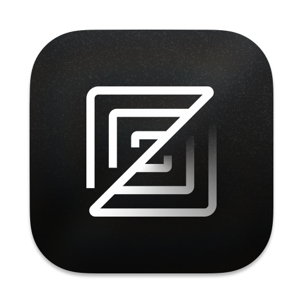

# ZZZ

> Zedless, Zeroed, Zen. — ZZZ, without the noise.



ZZZ is a community-maintained code editor,
a high-performance code editor originally built by the creators of
[Atom](https://github.com/atom/atom) and [Tree-sitter](https://github.com/tree-sitter/tree-sitter).

This fork exists because some things should not be configurable — they should simply be absent.

---

## Philosophy

> _无 ZZZ 之 ZZZ，是为真 ZZZ。_
> In English: ZZZ without ZZZ is true ZZZ.
>
> Strip away the telemetry, the upsells, the proprietary coupling —
> what remains is the editor.

Read [The Mission](./docs/src/mission.md) for the full reasoning: what ZZZ
keeps, what it removes, and how those boundaries are enforced.

---

## How ZZZ differs from upstream Zed

|                       | Upstream Zed                    | ZZZ                                    |
| --------------------- | ------------------------------- | -------------------------------------- |
| Telemetry             | Opt-out                         | Removed in source code                 |
| AI service promotion  | upsells                         | None                                   |
| Agent protocol        | Zed Agent (proprietary) and ACP | ACP Only                               |
| Commercial API        | promoted                        | Available, manually configured, silent |
| Contributor agreement | CLA required                    | No CLA — you keep your copyright       |

---

## How ZZZ differs from other Zed forks

[Gram](https://codeberg.org/GramEditor/gram) removes AI entirely — a valid and principled choice.
[Zedless](https://codeberg.org/zedless-editor/zedless) takes a similar privacy-first approach.

ZZZ takes a different position: **AI features can stay, but they default to your own infrastructure.**
The editor ships pointed at a local endpoint. No account, no cloud, nowhere asking you to sign up.
If you want a remote provider, you can add it yourself — explicitly and quietly.

---

## Installation

ZZZ does not provide pre-built binaries yet. Build from source:

```sh
cargo run
```

See the local build guides for system dependencies:
[macOS](./docs/src/development/macos.md) ·
[Linux](./docs/src/development/linux.md) ·
[Windows](./docs/src/development/windows.md)

To use an AI provider, add it manually in settings. Ollama is preferred, then llama.cpp; remote providers are never selected automatically.

---

## Contributing

No CLA. No copyright assignment.

Contributions are accepted under the
[Developer Certificate of Origin (DCO)](https://developercertificate.org/).
Sign your commits with `git commit -s` and you're done.

ZZZ requires AI-assisted review for every contribution. Original features
additionally require human review. See the
[AI-assisted contributions](./CONTRIBUTING.md#ai-assisted-contributions)
policy.

See [CONTRIBUTING.md](./CONTRIBUTING.md) for the full workflow.

---

## Upstream Sync

ZZZ tracks the upstream Zed `main` branch.

If a patch conflicts with upstream, opening an issue or PR is welcome.

---

## Acknowledgements

[Gram](https://codeberg.org/GramEditor/gram) proved that a ZZZ fork built
on genuine principles — not just preferences — is worth doing.
This project would not exist without that precedent.

---

## Sponsoring

If you’d like to support the project, please give it a star. : )

---

## Licensing

ZZZ is distributed under the
[GNU Affero General Public License v3.0 or later](./LICENSE-AGPL)
(AGPL-3.0-or-later).

Upstream Zed source is licensed primarily under GPL-3.0-or-later, with
Apache-2.0 components where marked. Those license texts are retained in
this repository as [LICENSE-GPL](./LICENSE-GPL) and
[LICENSE-APACHE](./LICENSE-APACHE) so the origin of each part stays
clear. Modifications made in this repository are offered under the AGPL.

The original Zed README is preserved at [README.ORIGINAL.md](./README.ORIGINAL.md).
