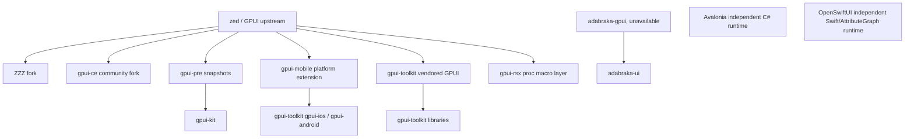
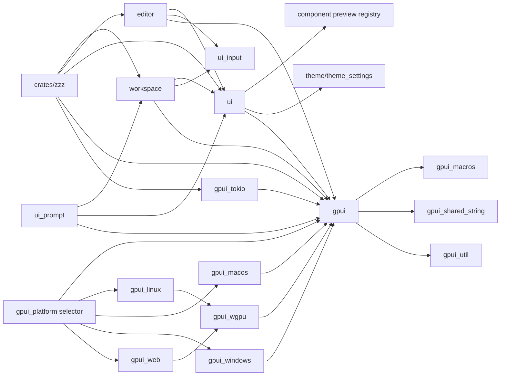

# ZZZ GUI 基础设施架构研究报告

- 研究日期：2026-10-02
- 目标系统：ZZZ `main`
- 最终基线 revision：`34fb99e58d0dac953afb9a577a3aae6f99fb0c71`
- 研究方式：本地源码静态分析；未安装依赖，未构建、运行或 benchmark 任何参考仓库
- 台账：[sources.tsv](./sources.tsv)、[inventory.tsv](./inventory.tsv)、[evidence.tsv](./evidence.tsv)、[experiments.tsv](./experiments.tsv)

正文中的 `[ZZZ-001]`、`[ZED-001]` 等编号均指向 `evidence.tsv` 中包含 repository、relative path、line locator、commit SHA、evidence kind 与 confidence 的对应 claim。

## 1. 面向决策的结论 {#decision}

ZZZ 不需要更换 GUI 框架，也不应把 Avalonia、OpenSwiftUI 或某个 GPUI fork 整体搬进来。当前 `Entity`/`Context` 所有权模型、按实体访问关系驱动的窗口失效、`Element` 的 `request_layout → prepaint → paint` 三阶段管线、可取消 `Task`、虚拟时钟测试框架和 Editor IME 实现，已经构成一套适合编辑器的基础。重构重点应是把这些机制从过度集中的 `Window` 和过宽的平台接口中整理出来，并先建立能证明行为与性能没有退化的观测和测试边界。

优先级最高的架构问题如下。

1. **缺少足够细的 frame 观测，当前无法安全判断拆分是否改善性能。** ZZZ 已记录 input-to-present histogram，但没有当前 Zed 的 `FrameEvent`、frame journal、阶段 timing collector 和生产并发 benchmark dispatcher。应先吸收这类观测能力，再做结构重构。[ZZZ-014][ZZZ-016][ZED-008][ZED-009]
2. **`Window` 是主要职责汇聚点。** 当前文件约 6,610 行；一个实例同时持有平台窗口、frame cache、Taffy、Scene、text system、focus、dispatch tree、hit testing、IME handler、prompt、drag、tooltip、cursor 和输入延迟状态。应先在 `gpui` crate 内按 `frame`、`interaction`、`text_input`、`accessibility`、`window_host` 模块拆分，保持公开 API 不变。[ZZZ-010][ZZZ-015][ZZZ-016][ZZZ-023][ZZZ-026]
3. **`Platform` 与 `PlatformWindow` 接口过宽，能力缺失只能表现为 no-op、warning 或 `None`。** 静态计数分别约 61 和 77 个方法。Web 后端正体现了这个问题：渲染可用，但 prompt、部分文件服务、剪贴板读取、IME candidate position 和桌面窗口控制并不完整。目标应是显式 capability，而不是继续扩大单个 trait。[ZZZ-018][ZZZ-019][ZZZ-036][ZZZ-037]
4. **renderer、windowing 和 GPUI runtime 依赖方向纠缠。** `PlatformWindow::draw(&Scene)` 让平台窗口拥有 renderer；`gpui_wgpu` 又依赖 `gpui`。应先建立内部 `render_api` 模块，再以实验决定是否抽成 `gpui_render` crate。抽取后的 render contract 必须不依赖 `App`、`Entity`、`Window`。[ZZZ-019][ZZZ-022][CE-002]
5. **核心 accessibility 在 ZZZ 缺位，而 Zed 已有可直接对照的同血统实现。** 当前 Zed 在 `Element` prepaint 中构建 AccessKit tree，并在 macOS、Windows、Linux 接入原生 adapter。这比在组件层另建一棵 ARIA-like tree 更适合作为 ZZZ 的基础设施方向。[ZZZ-045][ZED-001]–[ZED-007][GTK-007][GTK-008]
6. **真实像素 headless 验证目前只有 macOS 接通。** `TestWindow` 的抽象本身支持 headless renderer，但 `gpui_platform::current_headless_renderer` 在非 macOS 返回 `None`。`gpui-ce` 的 surface-free `WgpuHeadlessRenderer` 是可改造的候选，应先在 Linux/Windows 上做软件与硬件 adapter 实验。[ZZZ-021][ZZZ-033][CE-004]
7. **确定性测试覆盖了单线程语义，但可能隐藏生产并发问题。** 保留虚拟时钟 `TestDispatcher`，同时增加 Zed `ThreadedDispatcher` 风格的 benchmark/integration harness，用来覆盖 background-to-main handoff、timer、取消和窗口 teardown。[ZZZ-031][ZZZ-034][ZED-009][ZED-010]
8. **`ui_*` 边界出现了依赖反转补丁。** `ui_input` 通过进程级 `OnceLock` 等待 Editor 注入 factory，`ui_prompt` 则直接依赖 `workspace`。这两处应分别改成显式 text-input adapter 和产品层 prompt integration；`component` 的 preview registry 应与 `component_preview` 合并或改名，避免把“组件”概念拆成相互误导的 crate。[ZZZ-038]–[ZZZ-042]
9. **当前失效粒度有实际价值，但不应直接替换成 Avalonia property system 或 OpenSwiftUI AttributeGraph。** ZZZ 已能根据一帧中实际读取的实体建立 `EntityId → WindowInvalidator`，并对 opt-in cached view 重放 prepaint/paint ranges。先测量，再做可选、内部的 phase-specific invalidation；若收益不足，应拒绝增加新概念。[ZZZ-008]–[ZZZ-011][AVA-002][AVA-003][OSU-001][OSU-003]
10. **设计 token、纯 layout solver、allocation contract 和 semantic snapshot 值得借鉴，但应留在组件/测试层。** 它们不应成为替换 Taffy、Scene 或 Entity 的理由。[KIT-003][KIT-004][GTK-002]–[GTK-009]

推荐的总体方向是：

- 保持 `gpui` 为应用面对的稳定 façade；不要求 147 个直接或开发依赖 `gpui` 的 crate 集体迁移。
- 先把 Zed 已验证的 frame diagnostics、AccessKit 和生产并发测试能力吸收回来。
- 在同一 crate 内把 `Window` 拆成明确的内部所有者，完成后再评估 crate 抽取。
- 将 render scene/atlas/submission contract 与 window event loop 分开，使 WGPU、Metal、DirectX 和 headless backend 能遵守同一数据流。
- 将平台差异表示为 capability，并让 unsupported 状态可查询、可测试。
- 对 UI 层只做边界清理和语义标准化，不试图用新的 DSL 或完整 property/binding system 重写业务 UI。

当前证据下不建议开展：整体切换 gpui-ce；把 gpui-toolkit 的 vendored GPUI 当第二套核心；引入 Avalonia 风格完整 property/binding system；引入 OpenSwiftUI AttributeGraph/DynamicProperty runtime；把 `gpui-rsx` 设为默认 UI API；把 `gpui-mobile` 的全局 raw-pointer/text callback 模式带入桌面核心；在没有具体 GPU extension workload 前公开 custom draw registry。

## 2. 范围、revision 与证据限制 {#scope}

### 2.1 仓库状态 {#repository-state}

| 仓库         | HEAD           | 分支   | shallow | sparse                     | 工作树                                                     | 研究角色                                      |
| ------------ | -------------- | ------ | ------- | -------------------------- | ---------------------------------------------------------- | --------------------------------------------- |
| ZZZ          | `34fb99e58d0`  | `main` | 否      | 否                         | tracked clean；有用户提供的未跟踪 `.agents/...` 与 `.tmp/` | 目标系统                                      |
| zed          | `23d10a4754b`  | `main` | 是      | 是，仅 GPUI crate patterns | clean                                                      | 同血统主参考                                  |
| gpui-ce      | `175ef6657881` | `main` | 是      | 否                         | clean                                                      | 同血统核心 fork                               |
| gpui-kit     | `3467e6476002` | `main` | 是      | 否                         | clean                                                      | GPUI 组件/基础层                              |
| gpui-mobile  | `c7cab3a43970` | `main` | 是      | 否                         | clean                                                      | iOS/Android platform extension                |
| gpui-rsx     | `8e0751e9361c` | `main` | 是      | 否                         | clean                                                      | proc-macro DSL                                |
| gpui-toolkit | `321f98e5d004` | `main` | 是      | 否                         | clean                                                      | vendored core、移动端、设计/组件/测试实验集合 |
| adabraka-ui  | `e158684b23d9` | `main` | 是      | 否                         | clean                                                      | 组件库；核心 fork 不在 corpus                 |
| avalonia     | `17350180c33b` | `main` | 是      | 否                         | clean                                                      | 独立 runtime/语言的架构参考                   |
| openswiftui  | `b17d55b85bb3` | `main` | 是      | 否                         | clean                                                      | 独立声明式/依赖图参考                         |

完整字段见 [inventory.tsv](./inventory.tsv) 与 [repository-state.tsv](./repository-state.tsv)。

研究开始时 ZZZ HEAD 为 `dff8d8c3ddb7`；期间外部状态把 `main` 更新到 `34fb99e58d0`。变化集中在 Editor teardown/cancellation 代码，`crates/gpui` 与 `ui_*` 未变化。最终证据、locator、inventory 和报告均重新固定到 `34fb99e58d0`。详见 [worktree-notes.md](./worktree-notes.md)。

### 2.2 corpus 与限制 {#evidence-limits}

- `zed` 是 sparse checkout，只能检查 GPUI 及相关平台 crates；仓库级文档、历史和非 GPUI 垂直切片不在本地 corpus。
- 所有参考仓库均为 shallow clone。本报告不使用 shallow clone 的提交日期推断维护活跃度，也不做 contributor/bus-factor 结论。
- `adabraka-ui` 依赖 crates.io 上的 `adabraka-gpui`，该核心 fork不在 `.tmp/ui_ref`，所以其核心改动未知。[ADA-001]
- OpenSwiftUI 的 `OpenAttributeGraph`、`OpenRenderBox` 和可选 private framework dependencies 不在本地 corpus；关键 render path 仍有 WIP/Blocked/stub 标记。[OSU-008][OSU-009]
- 未运行任何参考仓库的 build、test、example、benchmark、simulator、screen reader 或 GPU workload。
- 未运行 ZZZ 的 build/test/benchmark。本报告对当前行为的判断来自 implementation/test source；性能与跨平台可用性结论均放入 [experiments.tsv](./experiments.tsv) 等待证伪。
- README、AGENTS 和设计文档仅用于 declared intent、来源和边界定位；行为结论优先引用实现或测试。

### 2.3 License 边界 {#license-boundary}

- ZZZ 为 AGPL-3.0-or-later。
- Zed GPUI manifest 为 Apache-2.0；Zed 仓库另有双许可证文件，但 sparse checkout 未物化根文件。[ZED-001]
- gpui-ce、gpui-kit 的相关 crate 为 Apache-2.0。[CE-001][KIT-006]
- gpui-mobile 提供 GPL-3.0-or-later、AGPL-3.0-or-later 或 Apache-2.0。[MOB-008]
- gpui-rsx、adabraka-ui、Avalonia、OpenSwiftUI 为 MIT；gpui-toolkit 根许可证是 ISC 风格许可。[RSX-006][ADA-004][AVA-010][OSU-010][GTK-011]

许可证看起来没有阻止“借鉴思想”或基于兼容条款移植小块代码，但任何直接复制仍应保留来源、copyright 与适用许可证记录。对 Zed/GPUI 同血统代码，优先通过 ZZZ 既有 upstream absorption 流程而不是从二次 fork 反向复制。

## 3. 共同血统与独立创新 {#lineage}

### 3.1 血统关系 {#lineage-map}

对核心 GPUI Rust 文件做相对路径与 byte hash 比较，结果记录在 [lineage.tsv](./lineage.tsv)：ZZZ/zed、zed/gpui-ce、zed/gpui-toolkit 都有大量共同路径，但当前 revision 已有显著修改；这些不是多份独立证据。

### 3.2 真正独立或新增的内容 {#independent-innovations}

- **Zed 当前 HEAD 相对 ZZZ 的新增价值**：AccessKit 核心/平台桥、frame journal 与 phase timing、`ThreadedDispatcher`、debug overlay，以及 container query/gesture/spring 等功能模块。前四项直接改变 ZZZ 重构的可验证性和 accessibility，优先级最高。
- **gpui-ce**：主要价值是 standalone packaging、WGPU renderer 文件拆分、surface-free WGPU headless renderer、shared shader artifacts。`gpui_ce_render` 仍依赖 `gpui`，所以它不是完整的依赖倒置范例。[CE-002]–[CE-004]
- **gpui-kit**：不实现核心 runtime；独立价值在 behavior/styled layer 分离、semantic tokens、稳定 façade、组件交互测试。[KIT-001]–[KIT-005]
- **gpui-mobile**：独立价值在外部 event loop、前后台 lifecycle、touch/momentum、native platform view；核心 `App`/`Entity`/render path 仍来自固定 Zed revision。[MOB-001]–[MOB-005]
- **gpui-rsx**：独立价值是 proc-macro 语法、diagnostics 和 compile-fail fixtures；它不提供新的状态、渲染或平台架构。[RSX-001]–[RSX-005]
- **gpui-toolkit**：核心部分是显式 vendored Zed snapshot；独立价值主要在纯 layout solver、design data、allocation contracts、semantic accessibility snapshot、mobile/wasm integration 和 custom GPU experiments。[GTK-001]–[GTK-010]
- **adabraka-ui**：可见部分是组件广度和视觉效果；因核心 fork缺失、关键 TextField API仍不完整、integration test证据不足，不作为基础架构依据。[ADA-001]–[ADA-003]
- **Avalonia**：独立证据来自成熟的 property metadata、layout queues、compositor client/server、text input client、headless host。[AVA-001]–[AVA-009]
- **OpenSwiftUI**：独立思想来自依赖图、transaction、typed host invalidation、DisplayList identity/version 和 renderer host；实现完整性不足，不能当作可移植代码基线。[OSU-001]–[OSU-009]

## 4. ZZZ 当前架构基线 {#zzz-baseline}

### 4.1 crate 关系 {#zzz-crate-graph}

静态 manifest 扫描见 [zzz-gui-dependencies.tsv](./zzz-gui-dependencies.tsv)：含 dev-dependencies 时，有 147 个 workspace crate 直接声明 `gpui`，68 个声明 `ui`。这个规模决定了重构必须保留 façade 与 re-export，不能要求全仓同时迁移。

| 当前 crate/module | 实际职责                                                                                                     | 主要问题                                                           |
| ----------------- | ------------------------------------------------------------------------------------------------------------ | ------------------------------------------------------------------ |
| `gpui`            | App/Entity/Context、Element/style/layout、Scene、input/focus/keymap、platform traits、test harness、profiler | runtime、view、interaction、render contract、platform API 聚在一处 |
| `gpui_platform`   | cfg 选择平台并构造 Application/headless                                                                      | 名称像接口层，实际是 selector/facade                               |
| `gpui_linux`      | X11/Wayland/headless、text、dispatcher、clipboard、WGPU ownership                                            | windowing 与 renderer lifecycle 耦合                               |
| `gpui_macos`      | AppKit、CoreText、Metal renderer/atlas、window/input/clipboard                                               | windowing、text、renderer 在同一 platform crate                    |
| `gpui_windows`    | Win32、DirectWrite、DirectX、input/IME/clipboard                                                             | 同上                                                               |
| `gpui_wgpu`       | WGPU context、atlas、CosmicText、renderer                                                                    | renderer 依赖完整 `gpui`；renderer 文件集中                        |
| `gpui_web`        | browser event loop、canvas/WebGPU、input、HTTP                                                               | 能力缺失通过 no-op/unsupported 表现                                |
| `gpui_tokio`      | Tokio runtime bridge与取消传播                                                                               | 边界清楚，建议保留                                                 |
| `ui`              | ZZZ styled components、spacing/typography/interaction helpers                                                | 产品组件与通用 primitives 混合，但仍可管理                         |
| `component`       | preview metadata/registry                                                                                    | 名称与实际职责不符                                                 |
| `ui_input`        | InputField façade、Editor type erasure                                                                       | 全局 factory 与初始化顺序                                          |
| `ui_prompt`       | ZZZ prompt + workspace settings integration                                                                  | 应位于产品层，不应被视为通用 UI crate                              |

### 4.2 状态、所有权与生命周期 {#state-ownership-lifecycle}

`App` 是单线程 UI state owner。`Application`/`ApplicationHandle` 用 `Rc<AppCell>` 保持它存活，`AppCell` 用 `RefCell<App>` 保护非重入更新；构造时断言在 main thread。[ZZZ-001][ZZZ-002][ZZZ-012]

`EntityMap` 将实际对象存成 `Box<dyn Any>`，`Entity<T>` 只携带 `EntityId`、类型信息和跨线程可安全递减的 atomic reference count。更新时实体被临时 lease 到栈上，因此同一实体的嵌套 read/update 会失败。这把 Rust 的独占可变访问规则延伸到了 type-erased app store，但重入错误在运行时暴露。[ZZZ-003]–[ZZZ-006]

`Context<T>` 将 App 服务和当前实体身份结合。`notify` 不直接 redraw；它把实体映射到上一帧实际读取它的窗口 invalidator，标记 view 与 ancestors dirty，并唤醒 platform frame source。这个“按实际读取建立依赖”是 ZZZ 已有的轻量依赖图，应该保留。[ZZZ-007]–[ZZZ-010]

生命周期由 `Platform::run` 驱动。`App::open_window` 通过 platform 创建 `PlatformWindow`，构建 root view，并为了避免未绘制窗口先执行一次 draw。窗口关闭通过 platform callback 回到 `AsyncWindowContext`，再将 window 标记移除。[ZZZ-012][ZZZ-013]

### 4.3 渲染管线与缓存 {#render-pipeline-cache}

`Element` 的 contract 明确分成：

1. `request_layout`：向 Taffy 注册样式/节点；
2. `prepaint`：读取 layout bounds，创建 hitbox、dispatch tree、tooltip/input handler 等交互快照；
3. `paint`：写入 `Scene`。

[ZZZ-017]

Window 的 platform frame callback检查 dirty/present demand，执行 `draw`，随后 `present` 把 `Scene` 交给 `PlatformWindow::draw`。`draw_roots` 对 root、prompt、drag、tooltip 和 deferred draw 逐层完成 layout/prepaint/paint。[ZZZ-014]–[ZZZ-016]

`AnyView::cached` 是 opt-in cache。它保存 bounds、content mask、text style、accessed entities，以及前一帧 prepaint/paint ranges；未 dirty 时重放 hitboxes、dispatch subtree、text layout、input handlers、listeners 和 scene commands。[ZZZ-011] 这说明 ZZZ 不是“每次全量重建一切”，但 cache 与整个 `Window::Frame` 的多个并行数组紧耦合，导致修改某一 phase 很容易破坏索引一致性。

### 4.4 平台与 renderer {#platform-renderer}

`Platform` 同时提供 lifecycle、display、dialog、clipboard、credentials、menus、cursor、keyboard layout、screen capture、HTTP 等服务；`PlatformWindow` 同时提供 window state、event callbacks、input handler、draw/atlas、IME 和 decorations。[ZZZ-018][ZZZ-019]

当前 renderer boundary 实际是 `PlatformWindow::draw(&Scene)`。Linux/Web window持有 `WgpuRenderer`，macOS window持有 Metal renderer，Windows window持有 DirectX renderer。`gpui_wgpu` 为了使用 `Scene`、atlas、geometry、text types而依赖 `gpui`，因此不能作为真正独立的 backend contract。[ZZZ-022]

Web 证明“trait 方法存在”不等于 capability 完整：它能创建 canvas/WebGPU window 并绘制，但多种 OS 服务明确 unsupported，`update_ime_position` 为空。[ZZZ-036][ZZZ-037] 目标架构需要可查询 capability matrix，并让测试按 capability 判定 N/A，而不是把 no-op 当实现。

### 4.5 输入、focus 与 IME {#input-focus-ime}

平台将 native event转成 `PlatformInput`，Window 统一做 modality tracking、mouse position、hit testing、capture/bubble 和 key dispatch。Mouse listener按 capture 正序、bubble 逆序执行；keyboard 从 focused dispatch node 建 path，先解析 multi-stroke keymap/action，再派发 low-level key listeners。[ZZZ-023]–[ZZZ-025]

IME 通过 `PlatformInputHandler` 回调 UI thread上的 `InputHandler`。Editor 在 element paint 时根据本帧 bounds 注册 `ElementInputHandler`；Editor 的实现维护 UTF-16 selection、marked ranges、composition underline、replacement、cursor candidate bounds和 undo grouping，并已有 multi-cursor IME tests。[ZZZ-026]–[ZZZ-029]

这个垂直链是成熟资产。重构应缩窄平台看到的接口，而不是改变 Editor 的 `EntityInputHandler` 语义。

### 4.6 异步、取消与线程边界 {#async-cancellation-threads}

- `ForegroundExecutor` 显式 `!Send`，在 UI/main thread poll future；`BackgroundExecutor` 接受 `Send` future。[ZZZ-030]
- `Task` drop 即取消，调用者必须 await、detach 或存储。[ZZZ-030]
- timer 来自 scheduler clock，测试可推进虚拟时间。[ZZZ-031]
- `AsyncApp` 持有 weak `AppCell`，await 后通过 `update` 回到 App；重入仍受 `RefCell` 约束。
- `gpui_tokio` 把 Tokio join handle 包到 GPUI Task，并在 GPUI Task 取消时 abort Tokio task。[ZZZ-032]

`unsafe` 主要出现在平台 FFI/GPU 和 element arena。Arena 的 raw allocation、drop function pointer与 `ArenaBox` raw pointer被集中管理，并用 generation-like `valid` flag阻止 clear 后解引用。[ZZZ-035] 这类 unsafe 不应在重构中散入新的 scene/platform共享类型。

### 4.7 测试与可观察性 {#testing-observability}

`TestWindow` 能模拟 resize、appearance、frame request 和 input；`TestAppContext` 能派发 action/keystroke/text并运行 scheduler。[ZZZ-033][ZZZ-034] 优点是快速、确定、无 OS 依赖。局限是：

- 真实像素 headless renderer只有 macOS；
- 普通 test scheduler是单线程虚拟模型；
- 当前 ZZZ profiler主要覆盖 task timing和整帧/input latency，没有当前 Zed 的 frame journal/phase collector；
- Editor benchmark能直接调用 layout/prepaint/paint，但还未形成跨阶段回归门槛。

### 4.8 五条代表性调用链 {#representative-flows}

#### A. 应用启动 → GPU frame

`crates/zzz/main` 调用 `Application::run`并初始化 `gpui_tokio`与服务 → `App::open_window`创建 platform window和 root Entity → platform `on_request_frame`回调 → `Window::draw` → root `request_layout` → `prepaint` → `paint`形成 `Scene` → `Window::present` → concrete Metal/DirectX/WGPU renderer → GPU submit/present。[ZZZ-012]–[ZZZ-016][ZZZ-043]

#### B. 平台输入 → 状态更新 → 下一帧

native event → platform转换 `PlatformInput` → `Window::dispatch_event` → hit test/focus path → capture/bubble listener/action → handler调用 `Entity::update`和 `cx.notify()` → App按上一帧 entity access mapping使对应 view/window dirty → frame waker → 下一帧重建或重放 cache。[ZZZ-007]–[ZZZ-011][ZZZ-023]–[ZZZ-025]

#### C. 键盘/IME → Editor → cursor/selection → 重绘

platform text system → `PlatformInputHandler` → 本帧由 Editor element注册的 `ElementInputHandler` → Editor UTF-16/marked-text更新 → composition highlight、selection、undo transaction变化 → `cx.notify()`/buffer observer → 下一帧重新 layout/paint文字、selection和caret。[ZZZ-026]–[ZZZ-029]

#### D. 异步任务 → UI 回写

`cx.spawn`在 foreground executor poll，或 `background_spawn`/Tokio在线程池运行 → future持有 `WeakEntity`/`AsyncApp` → await结束后 `cx.update`/`WeakEntity::update`回到 App → effect flush与 notify → frame invalidation。Task drop传播取消到 scheduler/Tokio。[ZZZ-030]–[ZZZ-032]

#### E. headless/GUI test

`TestAppContext`构造 `TestPlatform/TestWindow` → add/open window → `draw`或模拟 platform input →虚拟 scheduler `run_until_parked`/`advance_clock` →读取 Entity/focus/debug bounds/Scene；若有 `PlatformHeadlessRenderer`则生成像素。当前真实 backend只在 macOS selector接通。[ZZZ-021][ZZZ-031][ZZZ-033][ZZZ-034]

### 4.9 已验证的演进障碍 {#verified-obstacles}

- `Window`内部多个 range-indexed数组共同组成 frame cache，拆分时必须保持原子快照，不宜逐字段搬迁。[ZZZ-011][ZZZ-015]
- Renderer contract从 runtime crate取 Scene/types，单纯新建 crate容易形成循环；gpui-ce 的 `gpui_render -> gpui`说明“多一个 crate”本身不等于解耦。[ZZZ-022][CE-002]
- 平台 trait过宽导致 Web/移动端有大量不适用方法。[ZZZ-018][ZZZ-019][ZZZ-036][MOB-002]
- 公开 API扩散很广，必须 façade-first。
- `ui_input`和`ui_prompt`显示业务层边界已通过 global/static或反向依赖补洞。[ZZZ-038]–[ZZZ-042]

## 5. 参考项目架构分析 {#reference-projects}

### 5.1 zed {#reference-zed}

**Boundary**：ZZZ 的直接共同上游；本地只含 GPUI相关 crates。

**Entrypoints**：`gpui_platform::application/current_platform`、`Application::run`、各平台 `Platform`/`PlatformWindow`。

**Representative flow**：与 ZZZ 基本同构；新增 accessibility 在 element prepaint生成 `TreeUpdate`，frame末尾交 platform adapter；新增 frame journal/collector贯穿 dirty、draw、present和skipped-frame路径。[ZED-002]–[ZED-010]

**Core types/state**：`App`、`Entity`、`Window`、`Element`、`Scene`仍是同一血统。新增 `A11y` per-window state把 role、bounds、focus、action listeners与debug provenance绑定到 completed frame。[ZED-004]

**Extension seams**：AccessKit element hooks；platform adapter methods；threaded benchmark dispatcher；container query/gesture/spring等模块。

**Validation evidence**：accessibility debug tree、platform adapter implementation、frame collector、ThreadedDispatcher tests。

**Limitations**：不能把同血统实现当独立设计投票；sparse checkout没有完整产品使用证据。最合理的采用方式是走 ZZZ upstream absorption，而不是手工复制。

### 5.2 gpui-ce {#reference-gpui-ce}

**Boundary**：Zed GPUI community fork，目标是独立发布完整 GPUI生态。[CE-001]

**Entrypoints/flow**：仍是 `Application/App/Window/Element/Scene`主链；多数行为与 Zed同源。

**Core types/state**：核心仍集中在 `gpui`。新增 crates包括 scheduler、render artifacts、apple backend和辅助库；`gpui_elements`目前只是上层 editable text。[CE-005][CE-006]

**Extension seams**：WGPU renderer按 resources/pipelines/frame/surfaces/headless拆文件；shared shader interface可被 WGPU/Metal/DirectX复用。[CE-002][CE-003]

**Validation evidence**：WGPU headless readback implementation、surface recovery test、scheduler tests。

**Limitations**：`gpui_render`依赖 `gpui`，不能直接解决 dependency inversion；fork吸收会引入另一条 upstream链。适合借鉴 renderer内部模块化和 headless实现，不适合整体替换。

### 5.3 gpui-kit {#reference-gpui-kit}

**Boundary**：建立在精确 pin 的 `gpui-pre` snapshot上的 application/component framework，不实现 platform或renderer core。[KIT-001]

**Entrypoints**：`gpui_kit::application/init/open_window`；kit root re-export GPUI，隐藏底层版本迁移。[KIT-005]

**Representative flow**：App调用 kit init → base behavior globals → styled component render成原生 GPUI elements → GPUI完成layout/paint。

**Core types/state**：Base持交互/状态/无样式行为，Component投射主题与视觉；semantic token按视觉角色命名；selected/open/focus-ring等状态trait与视觉分离。[KIT-002]–[KIT-004]

**Extension seams**：component traits、Root plugins、theme tokens、test-support façade。

**Validation evidence**：大量 `#[gpui::test]`组件交互测试和纯逻辑测试；本研究未运行。

**Limitations**：snapshot pin意味着每次 GPUI API升级必须整体协调；组件库范围远大于 ZZZ当前重构需要。适合借鉴层次与语义，不适合替换 `crates/ui`。

### 5.4 gpui-mobile {#reference-gpui-mobile}

**Boundary**：在固定 Zed GPUI revision上新增 iOS/Android platform crates和大量移动服务包。[MOB-001]

**Entrypoints**：iOS C ABI/app delegate；Android NativeActivity/JNI event loop；`current_platform`。

**Representative flow**：foreign lifecycle callback → platform/window raw handle → touch/key转换为 GPUI input → WGPU Metal/Vulkan render。Native platform view在 GPUI paint中同步bounds与visibility。[MOB-002][MOB-003][MOB-005]

**Core types/state**：核心状态仍在 GPUI；移动端另有全局 window pointers、thread-local text callback和lifecycle globals。[MOB-003][MOB-004]

**Extension seams**：Platform trait、FFI、PlatformView factory、package APIs。

**Validation evidence**：Android geometry/input unit tests、momentum tests；未见本地 simulator/device运行证据。

**Limitations**：生命周期和文本输入有全局状态；iOS termination只记录日志；momentum测试用真实 sleep。[MOB-004][MOB-006][MOB-007] 只借鉴 foreign event loop/lifecycle capability，不采用这些全局状态模式。

### 5.5 gpui-rsx {#reference-gpui-rsx}

**Boundary**：纯 proc-macro syntax layer，不参与 runtime。[RSX-001]

**Entrypoints**：`rsx!`、strict/permissive variants。

**Representative flow**：token parse → element/attribute/class codegen →普通 GPUI builder chain →编译器 type-check。

**Core types/state**：无 UI state；stateful element identity由source-location auto ID或显式 key/id生成。[RSX-003]

**Extension seams**：attribute/class mapping tables、custom base constructors。

**Validation evidence**：trybuild compile-fail/pass、macro tests、API snapshot。[RSX-004]

**Limitations**：动态 class会生成runtime matcher；strict path可panic；macro必须持续跟踪 GPUI method surface。[RSX-005] 它解决作者体验，不解决本次架构问题。

### 5.6 gpui-toolkit {#reference-gpui-toolkit}

**Boundary**：一套包含 vendored Zed GPUI、mobile backend、design system、UI kit、charts、Python runtime和QA脚本的大型工作区。[GTK-001]

**Entrypoints**：vendored GPUI application；`gpui-toolkit`aggregate features；showcase/web/mobile apps。

**Representative flow**：组件/图表生成 GPUI elements或custom draw → vendored GPUI → native/WGPU renderer。纯 solver/design crates可独立于GPUI运行。

**Core types/state**：core同源；独立部分包括纯 `DesignSystem`、pure `gpui-builder`、allocation probes、UI-kit accessibility tree。[GTK-002]–[GTK-009]

**Extension seams**：custom draw registry允许 backend subtrait downcast；mobile platform crates；feature-heavy aggregate crate。[GTK-010]

**Validation evidence**：property tests、allocation budgets、semantic accessibility snapshots、visual/web QA scripts。

**Limitations**：vendored patch stack和大量feature使维护成本高；custom draw能力按backend分叉；screen-reader QA仍明确pending。[GTK-001][GTK-007] 适合提取测试模式和纯模块，不适合成为ZZZ新核心。

### 5.7 adabraka-ui {#reference-adabraka-ui}

**Boundary**：依赖未包含的 `adabraka-gpui` fork的单crate组件库。[ADA-001]

**Entrypoints**：`adabraka_ui::init`及大量 `RenderOnce` components。

**Representative flow**：component builder → GPUI element/entity → forked GPUI，核心链未知。

**Core types/state**：多数组件自行持有 `Entity<State>`、FocusHandle、Theme。

**Extension seams**：builder APIs、themes、effects、charts。

**Validation evidence**：可见测试主要是少量icon helpers；未见完整headless integration suite。[ADA-003]

**Limitations**：TextField的 `on_change`是no-op，IME bounds/point mapping返回None。[ADA-002] 组件数量不能作为基础设施成熟度证据，因此只做有限分析。

### 5.8 Avalonia {#reference-avalonia}

**Boundary**：C#/.NET retained-mode cross-platform GUI framework，语言、runtime和对象模型均不同。

**Entrypoints**：`Application/AppBuilder`、`Window/TopLevel`、platform `IWindowImpl`、Dispatcher。

**Representative flow**：property变化 → metadata observer调用 `InvalidateMeasure/Arrange/Visual` → LayoutManager queue和bounded passes → Visual render录制 → CompositingRenderer更新 CompositionTarget → Compositor batch → ServerCompositor/render loop。[AVA-001]–[AVA-005]

**Core types/state**：`AvaloniaObject/ValueStore`、logical/visual tree、`Layoutable`、CompositionVisual/server visual；所有 UI object绑定Dispatcher并验证线程。[AVA-001]

**Extension seams**：windowing/render interface、platform IME、automation peers、headless platform、compositor feature。

**Input/IME**：InputManager有pre/process/post阶段；TextInputMethodManager只面向一个窄 `TextInputMethodClient`，同步preedit、surrounding text、selection、cursor rect与transform。[AVA-006]–[AVA-008]

**Validation evidence**：完整headless window、input injection、稳定循环、render tests和各平台项目。

**Limitations**：完整property/binding/visual tree runtime依赖GC、reflection、C# object model；移植表面API会与GPUI现有Entity模型冲突。可迁移的是“失效类型、队列、client/server边界、窄IME client、headless host”思想。

### 5.9 OpenSwiftUI {#reference-openswiftui}

**Boundary**：SwiftUI compatible implementation，核心依赖 OpenAttributeGraph/OpenRenderBox。

**Entrypoints**：`App/Scene/WindowGroup`、ViewGraph/ViewRendererHost、platform hosting layer/stdout renderer。

**Representative flow**：DynamicProperty/AttributeGraph mutation → GraphHost transaction → typed host property invalidation → `updateOutputs` → versioned DisplayList → renderer host → next update time。[OSU-001]–[OSU-005]

**Core types/state**：GraphHost/subgraphs/attributes、DynamicPropertyBuffer、ViewGraph、DisplayList identity/version/cache。

**Extension seams**：renderer configuration、platform host、stdout renderer、TestHost。

**Validation evidence**：DynamicProperty tests、compatibility tests、stdout renderer output tests和TestHost API。[OSU-006][OSU-007]

**Limitations**：unsafe heterogeneous storage、独立图runtime、外部依赖，以及关键path的 WIP/Blocked/stub。[OSU-004][OSU-008][OSU-009] 只适合借鉴 transaction、dirty property bitset、display-list identity与renderer host分离。

## 6. 对照矩阵 {#comparison-matrix}

状态含义：`verified`=实现/测试直接支持；`partial`=核心存在但覆盖不完整；`claimed`=只有一手文档声明；`unknown`=静态证据不足。`unknown`不等于缺失。

### 6.1 核心状态、生命周期、render、platform、async {#matrix-core}

| 项目         | 状态/所有权                       | 生命周期                                            | render管线                            | platform/backend                        | async/scheduler                                     |
| ------------ | --------------------------------- | --------------------------------------------------- | ------------------------------------- | --------------------------------------- | --------------------------------------------------- |
| ZZZ          | verified：App-owned EntityMap     | verified：desktop/web run/open/close                | verified：layout/prepaint/paint/Scene | partial：接口宽，Web/headless有缺口     | verified：foreground/background/virtual clock/Tokio |
| zed          | verified：同源                    | verified：同源                                      | verified：同源+frame journal          | verified：desktop + a11y adapters       | verified：新增ThreadedDispatcher                    |
| gpui-ce      | verified：同源                    | verified：同源                                      | verified：同源，WGPU模块化            | partial：更多crate但render仍依赖gpui    | verified：standalone scheduler                      |
| gpui-kit     | N/A：使用GPUI                     | N/A                                                 | verified：组件生成GPUI elements       | N/A                                     | partial：组件级async模式                            |
| gpui-mobile  | verified：复用GPUI                | partial：iOS/Android lifecycle存在但有全局状态/空洞 | verified：WGPU render接入             | partial：设备验证未知                   | partial：platform dispatcher存在，未运行            |
| gpui-rsx     | N/A                               | N/A                                                 | verified：生成builder chain           | N/A                                     | N/A                                                 |
| gpui-toolkit | verified：vendored同源            | partial：native/web/mobile均有但版本分叉            | verified：vendored+custom draw        | partial：patch stack和capability分叉    | verified：同源scheduler/测试工具                    |
| adabraka-ui  | unknown：fork core不在corpus      | unknown                                             | partial：组件render可见               | unknown                                 | partial：smol/futures依赖，行为未验证               |
| Avalonia     | verified：property store + trees  | verified：多平台TopLevel                            | verified：layout→composition→server   | verified：独立windowing/render projects | verified：Dispatcher/render loop                    |
| OpenSwiftUI  | partial：GraphHost/AttributeGraph | partial：App/Scene存在                              | partial：DisplayList/renderer仍WIP    | partial：platform host依赖外部模块      | partial：transaction/update loop可见                |

### 6.2 输入、IME、accessibility、组件 API {#matrix-interaction}

| 项目         | 输入/focus                                   | IME/text                                    | Accessibility                                          | 组件/声明式 API                                     |
| ------------ | -------------------------------------------- | ------------------------------------------- | ------------------------------------------------------ | --------------------------------------------------- |
| ZZZ          | verified：hit test + capture/bubble + keymap | verified：Editor链与tests；Web position缺口 | unknown/未见core bridge                                | verified：builder/Element/Render + ZZZ ui           |
| zed          | verified                                     | verified                                    | verified：AccessKit core+macOS/Windows/Linux           | verified：原生builder，新增语义hooks                |
| gpui-ce      | verified：同源                               | verified：同源                              | verified：同源AccessKit                                | verified：同源 + editable_text                      |
| gpui-kit     | verified：组件交互丰富                       | verified：Input/editor实现                  | verified/partial：依赖GPUI AccessKit，平台QA另行要求   | verified：Base/Component façade                     |
| gpui-mobile  | partial：touch→mouse、key                    | partial：global callback路径                | unknown：设备bridge证据不足                            | verified：mobile components/platform views          |
| gpui-rsx     | N/A                                          | N/A                                         | partial：可生成a11y属性但依赖GPUI                      | verified：proc macro DSL                            |
| gpui-toolkit | verified                                     | partial：native/mobile/web覆盖不均          | partial：native映射+snapshot，screen-reader QA pending | verified：large UI kit/design system                |
| adabraka-ui  | partial                                      | partial：TextField缺bounds和callbacks       | claimed：README；实现证据不足                          | verified：大量组件                                  |
| Avalonia     | verified：raw input/focus/nav                | verified：TextInputMethodClient             | verified：Automation/platform projects                 | verified：Control/style/template/XAML               |
| OpenSwiftUI  | partial：大量event/gesture模块               | unknown：本次未形成完整IME链                | partial：core metadata多，platform行为未验证           | verified/partial：View/Layout API，render完整性不足 |

### 6.3 测试、可观察性、边界与采用风险 {#matrix-adoption}

| 项目         | Headless/测试                               | 诊断/benchmark                     | 边界质量                                 | 对ZZZ采用            |
| ------------ | ------------------------------------------- | ---------------------------------- | ---------------------------------------- | -------------------- |
| ZZZ          | verified deterministic；partial real pixels | partial                            | partial：Window/platform集中             | 基线                 |
| zed          | verified + concurrent harness               | verified frame journal/collector   | partial但领先ZZZ                         | 直接吸收优先         |
| gpui-ce      | verified WGPU headless实现                  | verified profiler/bench演进        | partial：文件拆分好，crate依赖未完全倒置 | 改造采用             |
| gpui-kit     | verified组件tests                           | partial benches                    | verified app façade/behavior-style分层   | 模式采用             |
| gpui-mobile  | partial unit tests                          | partial                            | partial：FFI/global state                | 思想采用，代码需重做 |
| gpui-rsx     | verified macro/trybuild                     | claimed zero-overhead；未测        | 清晰但API耦合强                          | 当前拒绝默认化       |
| gpui-toolkit | verified property/allocation/semantic tests | verified多种报告                   | partial：vendoring/feature graph复杂     | 挑选模式             |
| adabraka-ui  | unknown/薄                                  | unknown                            | partial：单crate大表面                   | 不作核心依据         |
| Avalonia     | verified mature headless/render tests       | verified layout/render diagnostics | verified分层，概念多                     | 架构思想采用         |
| OpenSwiftUI  | verified局部/compat/stdout                  | partial                            | partial：清晰概念但WIP/外部依赖          | 仅思想采用           |

## 7. 可迁移设计模式清单 {#transferable-patterns}

| 模式                                             | 来源与证据                                   | ZZZ具体问题                                                         | 建议采用方式                                           | 收益                                                   | 成本/风险                                | 失效条件                                     |
| ------------------------------------------------ | -------------------------------------------- | ------------------------------------------------------------------- | ------------------------------------------------------ | ------------------------------------------------------ | ---------------------------------------- | -------------------------------------------- |
| Frame journal + phase timing + collector         | Zed [ZED-008]                                | 无法量化Window拆分与cache命中                                       | 直接吸收，同血统feature-gated                          | 重构前后可证伪；定位latency来源                        | profiler开销、数据量                     | 开销>2%或无法稳定关联input/frame             |
| Production-like threaded dispatcher              | Zed [ZED-009][ZED-010]                       | 单线程virtual tests隐藏handoff/race                                 | 改造吸收，限定bench/integration                        | 覆盖真实并发且保留deterministic tests                  | flaky与真实timer噪声                     | 100-run稳定性不达标                          |
| AccessKit tree in Element prepaint               | Zed [ZED-002]–[ZED-007]                      | ZZZ无core/native a11y链                                             | 通过upstream absorption直接采用                        | 语义与layout bounds同帧；原生adapter现成               | 组件语义补标、平台QA                     | native walkthrough不通过或API与ZZZ delta冲突 |
| WGPU renderer内部模块化                          | gpui-ce [CE-003]                             | `wgpu_renderer.rs`集中资源/提交/表面恢复                            | 改造采用，先仅文件/module拆分                          | 降低修改冲突；更易独测surface/headless                 | 机械拆分可能无收益                       | 编译时间/维护没有改善且增加公开surface       |
| Surface-free WGPU headless                       | gpui-ce [CE-004]                             | 非macOS缺真实像素验证                                               | 先实验，成功后接入test-support                         | Linux/Windows visual regression；renderer contract验证 | 软件adapter差异、GPU CI不稳定            | 不能在CI稳定初始化或pixel drift过大          |
| 明确的 measure/arrange/render dirty queue        | Avalonia [AVA-002][AVA-003]                  | `notify`通常使cached view完整layout/prepaint/paint                  | 仅做内部opt-in实验，不引入property system              | 高频局部变化可减少phase work                           | API/正确性复杂度；状态变化未声明影响范围 | phase work下降<20%或出现像素/input差异       |
| 窄 TextInputClient                               | Avalonia [AVA-007][AVA-008]                  | PlatformInputHandler携带AsyncWindowContext，platform边界知道runtime | 改造采用：平台只见text client capability               | 缩窄IME边界；便于Web/mobile/headless                   | 迁移macOS/Windows/Linux文本桥            | 无法表达Editor multi-cursor/UTF-16语义       |
| Behavior layer 与 styled layer 分离              | gpui-kit [KIT-002][KIT-003]                  | ZZZ `ui`中状态、交互、视觉常混合                                    | 新组件逐步采用；不重写全部现有组件                     | 测试更小、theme变化影响更窄                            | 双层API可能过度抽象                      | 概念数增加且组件实现反而重复                 |
| Semantic tokens独立于组件名                      | gpui-kit/toolkit [KIT-004][GTK-005][GTK-006] | theme/style改动扩散，platform适配难测                               | 在现有theme/ui styles中渐进整理                        | 可测试、可序列化、适配density/reduced motion           | 与现有ThemeStyles重叠                    | 无法减少重复token或增加迁移负担              |
| Pure solver + property/allocation contracts      | gpui-toolkit [GTK-002]–[GTK-004][GTK-009]    | workspace adaptive layout难以独测；无alloc预算                      | 仅用于复杂shell layout和测试基础                       | deterministic、可fuzz、可设alloc gate                  | 不应替换Taffy；两套layout概念            | 不能映射真实workspace需求或产生重复布局真相  |
| Semantic accessibility snapshot/readiness matrix | gpui-toolkit [GTK-007][GTK-008]              | native a11y需要组件级可重复断言                                     | 在Zed AccessKit port后借鉴测试层                       | 组件semantics gate + 明确platform QA欠账               | 不能证明screen reader真实行为            | 被误用为native QA替代品                      |
| Foreign event loop/run_embedded lifecycle        | gpui-mobile/OpenSwiftUI host                 | Web/mobile由外部run loop驱动                                        | 仅抽象lifecycle capability；保留`run_embedded`         | 为Web/mobile/embedding准备                             | raw pointer/FFI安全、资源暂停恢复        | 桌面重构被移动端需求拖累                     |
| Transaction + versioned display output           | OpenSwiftUI [OSU-002][OSU-003][OSU-005]      | effects/frame更新缺少显式dirty reasons/version diagnostics          | 借鉴为FrameBuildId/dirty reasons；不引入AttributeGraph | 更清晰的frame provenance、cache诊断                    | 过度设计                                 | 没有可测debug/性能收益                       |

## 8. 当前不适合 ZZZ 的设计 {#rejected-designs}

1. **完整 Avalonia property/binding system**：它与GC object、dispatcher-bound `AvaloniaObject`、logical/visual tree和style priority共同工作。移植后会与 `Entity/Context`形成第二套状态模型，增加内存、订阅和概念数量。
2. **OpenSwiftUI AttributeGraph/DynamicProperty runtime**：依赖外部graph runtime和unsafe heterogeneous buffer，且本地render path仍不完整。[OSU-004][OSU-009]
3. **整体采用 gpui-ce 或 gpui-toolkit vendored core**：会让 ZZZ 同时跟踪 Zed和二次fork的patch stack。只应吸收明确、独立、可验证的差异。[CE-001][GTK-001]
4. **把 `gpui-rsx` 设成公共/默认组件 API**：它增加宏语法、生成ID、dynamic matcher和GPUI API snapshot维护；基础架构尚未稳定时会放大迁移面。[RSX-003]–[RSX-005]
5. **复制 gpui-mobile 的全局 text callback/raw window pointer**：这些模式绕开Entity lifecycle并依赖FFI调用顺序。[MOB-003][MOB-004]
6. **用独立constraint solver替换Taffy**：`gpui-builder`适合应用壳层的高层collapse/adaptation，不适合替代Element layout contract。[GTK-002][GTK-003]
7. **现在公开 custom draw registry**：backend-specific downcast使capability分叉，并会把GPU资源生命周期暴露给应用。[GTK-010]
8. **强制所有业务UI只依赖 `ui`而不能直接依赖 `gpui`**：Editor和Workspace大量使用Entity、Window、Element和test APIs，硬包装只会复制API。应稳定 `gpui` façade并清理少数明显反向依赖。

## 9. 建议的目标架构 {#target-architecture}

### 9.1 目标数据流 {#target-data-flow}

```mermaid
flowchart LR
    Native[Native/Web events] --> Host[WindowHost capabilities]
    Host --> Router[InteractionRouter]
    Router --> Dispatch[HitTest + Focus + Key/Action dispatch]
    Dispatch --> Handler[Entity handler]
    Handler --> Runtime[App / Entity / Context]
    Runtime --> Invalid[InvalidationQueue + dirty reasons]
    Invalid --> Scheduler[FrameScheduler]
    Scheduler --> Builder[FrameBuilder]
    Builder --> Layout[Element tree + Taffy layout]
    Layout --> Prepaint[Prepaint: hitboxes/dispatch/text/a11y]
    Prepaint --> Paint[Paint: RenderScene]
    Paint --> Frame[BuiltFrame immutable snapshot]
    Frame --> Renderer[Renderer backend]
    Renderer --> Target[RenderTarget / GPU submission]
    Target --> Host
    Frame --> A11y[AccessibilityAdapter]
    Frame --> Diag[Frame journal / metrics]
```

`BuiltFrame`应把当前 `Frame`中的并行状态按职责组合成不可变快照：

- `RenderScene`：GPU/backend消费；
- `InteractionSnapshot`：hitboxes、dispatch tree、focus path、tab stops、cursor requests；
- `TextInputSnapshot`：当前client和candidate geometry；
- `AccessibilityUpdate`：AccessKit tree update与action map；
- `FrameDiagnostics`：build id、dirty reasons、cache hit、各阶段时间和input provenance。

frame build完成后，renderer与platform adapter只读这些输出；下一帧 cache reuse从上一个 completed snapshot复制范围，不再直接在Window的大量Vec之间随意操作。

### 9.2 `gpui`内部模块边界 {#target-gpui-modules}

第一目标是模块边界，不是立即新增crate。

| 目标模块         | 内容                                                                                     | 从当前迁入                                                        |
| ---------------- | ---------------------------------------------------------------------------------------- | ----------------------------------------------------------------- |
| `runtime/`       | `App`、`AppCell`、`EntityMap`、`Context`、effect queue、Subscription、globals、executors | `app.rs`、`app/*`、`executor.rs`、`subscription.rs`               |
| `frame/`         | `FrameScheduler`、`WindowInvalidator`、`BuiltFrame`、cache ranges/replay、frame journal  | `window.rs`中的frame callback、Frame、dirty/cache代码             |
| `view/`          | `Element`、`AnyView`、style、Taffy bridge、standard elements                             | `element.rs`、`view.rs`、`style.rs`、`elements/*`                 |
| `interaction/`   | hit testing、dispatch tree、focus/tab、keymap/actions、pointer capture                   | `window.rs`、`interactive.rs`、`key_dispatch.rs`                  |
| `text_input/`    | `TextInputClient` contract、EntityInputHandler adapter、candidate geometry               | `input.rs`、`platform.rs`中的PlatformInputHandler、window注册逻辑 |
| `accessibility/` | Zed AccessKit semantics、tree builder、debug snapshot/action routing                     | 从Zed吸收                                                         |
| `render_api/`    | Scene、atlas/resource contracts、renderer target/submission                              | `scene.rs`、`platform.rs` atlas/draw相关部分                      |
| `window/`        | 公开Window façade；组合以上模块并保持现有methods                                         | 当前 `window.rs`薄化                                              |
| `platform_api/`  | lifecycle、window host、services与capability query                                       | 当前 `platform.rs`拆分                                            |

`Window`仍是公开调用入口，但内部不再直接拥有每个算法。这样不改变 `Render::render(&mut Window, &mut Context<_>)`、`window.on_*`或Editor API。

### 9.3 crate 级目标 {#target-crates}

| crate                | 目标动作                                           | 说明                                                                                      |
| -------------------- | -------------------------------------------------- | ----------------------------------------------------------------------------------------- |
| `gpui`               | **保留并作为稳定 façade**                          | 继续re-export所有公开类型；内部模块化；避免消费者迁移                                     |
| `gpui_platform`      | **保留 selector/facade，澄清名称/文档**            | 继续提供 `application/current_platform/headless`；不承担核心trait定义                     |
| 新 `gpui_render`     | **条件性拆分**                                     | 仅在EXP-005证明无cycle、编译与迁移可接受后，从`render_api`抽出；不得依赖App/Entity/Window |
| `gpui_wgpu`          | **保留，先模块拆分，再实现统一Renderer与headless** | 借鉴gpui-ce目录；不照搬其反向依赖                                                         |
| `gpui_linux`         | **保留**                                           | windowing/input/text/clipboard；renderer通过统一contract组合                              |
| `gpui_macos`         | **保留**                                           | 先将Metal renderer作为内部backend适配统一contract；是否抽`gpui_metal`由编译数据决定       |
| `gpui_windows`       | **保留**                                           | DirectX同上；不立即增加crate                                                              |
| `gpui_web`           | **保留并显式capability**                           | unsupported能力进入capability table；IME/clipboard分别实验                                |
| `gpui_macros`        | **保留**                                           | 不扩大到RSX默认DSL                                                                        |
| `gpui_shared_string` | **保留**                                           | 边界清楚                                                                                  |
| `gpui_tokio`         | **保留**                                           | runtime bridge边界清楚                                                                    |
| `gpui_util`          | **保留并限制新增职责**                             | 只放真正跨crate、小型、无GUI runtime依赖工具                                              |
| `ui`                 | **保留，逐步分清behavior/visual**                  | 不做全量重写；新增组件遵循语义state与visual projection分离                                |
| `ui_macros`          | **保留**                                           | 仅服务ZZZ组件API                                                                          |
| `component`          | **合并或改名**                                     | 与`component_preview`合并为preview/registry职责，或改名`ui_component_registry`            |
| `ui_input`           | **重构并可能改名`ui_text_input`**                  | 移除static OnceLock；接口下沉，Editor adapter显式注册/传入                                |
| `ui_prompt`          | **迁移至产品集成层并逐步废弃crate名**              | 放到`zzz`或workspace UI integration；generic prompt renderer接口仍在gpui/ui               |

### 9.4 平台与renderer接口 {#target-platform-renderer}

公开兼容层可继续暴露 `Platform`，内部改为组合capability：

- `AppLifecycle`：run/run_embedded/activate/background/suspend/quit；
- `WindowHost`：create/destroy/resize/frame callbacks/raw handles；
- `InputSource`：normalized pointer/key/touch/drag events；
- `TextInputBridge`：绑定一个窄 `TextInputClient`；
- `AccessibilityBridge`：initial tree/update/action/focus；
- `SystemServices`：clipboard、dialogs、credentials、open URL、menus、screen capture；
- `RendererFactory/RenderTarget`：从window surface创建backend，不向platform暴露App。

每个backend提供静态/运行时 `PlatformCapabilities`。测试矩阵把unsupported标为N/A，避免“方法存在但为空”的误判。

### 9.5 状态与失效目标 {#target-invalidation}

保留当前 `cx.notify()`语义和Entity access tracking。新增内容分两层：

1. **立即增加 dirty reason 观测**：记录Entity、window、原因、phase/cache命中，不改变行为。
2. **可选实验 `notify_with(InvalidationScope)`**：只在少量内部组件上测试 `Layout`、`Prepaint`、`Paint`、`Accessibility`范围。默认仍是完整 view invalidation，错误声明不能破坏正确性。

不引入公开property metadata或自动binding priority系统。若EXP-007达不到明确收益，停止在观测层。

## 10. 分阶段重构路线 {#roadmap}

### 阶段 0：建立可证伪基线（可以立即实施） {#phase-0}

- **涉及**：`gpui/profiler`、`WindowInvalidator`、`BenchAppContext`、`input_latency_ui`、benchmark scripts。
- **目标**：吸收Zed frame event/journal/collector；给layout/prepaint/paint/cache replay/present统一ID与timing；保存clean/incremental build基线。
- **前置**：无。
- **验收**：EXP-001/002 instrumentation overhead ≤2%；能关联input、dirty、draw、present与skipped frame。
- **风险**：profiling本身改变timing。
- **回滚**：feature gate关闭，保留类型但不采样。

### 阶段 1：补齐验证与 accessibility 边界（可以立即实施，但平台QA需实验） {#phase-1}

- **涉及**：`gpui` Element/Window、`gpui_macos/windows/linux`、test support。
- **目标**：按upstream流程吸收Zed AccessKit；加入semantic snapshot/action tests；引入ThreadedDispatcher作为bench/integration harness。
- **前置**：阶段0能观察frame开销。
- **验收**：EXP-006/008；现有input/focus/IME tests全通过；无默认性能回归。
- **风险**：组件缺少stable ID/role；平台adapter差异。
- **回滚**：accessibility feature/capability可关闭；不移除原有input路径。

### 阶段 2：扩展真实 headless renderer（需要先做实验） {#phase-2}

- **涉及**：`gpui_wgpu`、`gpui_platform` test-support、CI GPU/software adapter配置。
- **目标**：原型化gpui-ce风格offscreen WGPU renderer；建立固定Scene corpus。
- **前置**：统一frame diagnostics；明确pixel baseline policy。
- **验收**：EXP-003。
- **风险**：software adapter不可用、驱动差异、CI hang。
- **回滚**：保留macOS renderer；WGPU headless只作可选job。

### 阶段 3：在 `gpui` 内拆 `Window`（可以立即实施，行为保持） {#phase-3}

- **涉及**：`window.rs`、`view.rs`、`element.rs`、`interactive.rs`、`input.rs`。
- **目标**：抽出`frame`、`interaction`、`text_input`、`accessibility`内部owners；形成不可变`BuiltFrame`；公开Window方法仅委托。
- **前置**：阶段0/1测试与metrics可用。
- **验收**：公开API零变化；golden Scene/semantic/input tests一致；EXP-001/002/011不回退。
- **风险**：range replay索引错位、focus/input handler生命周期改变。
- **回滚**：逐模块小PR；每次保持旧owner和adapter，可单独revert。

### 阶段 4：renderer contract与WGPU模块化（需要先做实验） {#phase-4}

- **涉及**：`scene.rs`、`platform.rs` draw/atlas部分、`gpui_wgpu`、各platform renderer。
- **目标**：先建内部`render_api`；WGPU按resources/pipelines/frame/surface/headless拆分；统一`Renderer/RenderTarget/FrameSubmission`。
- **前置**：BuiltFrame稳定；EXP-003有结果。
- **验收**：EXP-005；平台输出/错误恢复不变；consumer零编辑。
- **风险**：Scene共享类型造成cycle；Metal/DirectX能力不对称。
- **回滚**：保留`PlatformWindow::draw` compatibility adapter；新contract behind feature/internal module。

### 阶段 5：平台 capability拆分与lifecycle明确化（实验后实施） {#phase-5}

- **涉及**：`platform.rs`、`gpui_platform`、Linux/macOS/Windows/Web。
- **目标**：宽trait内部拆capability；Web不支持项显式报告；为external event loop保留`run_embedded`。
- **前置**：render/text/a11y边界已从Window抽开。
- **验收**：所有backend capability matrix有test；无静默no-op；default desktop API兼容。
- **风险**：trait object/adapter样板增加。
- **回滚**：旧`Platform`作为composite façade，逐项委托新capability。

### 阶段 6：清理 `ui_*` 边界（可以与阶段3后半并行，但不应先于核心基线） {#phase-6}

- **涉及**：`ui_input`、Editor adapter、`ui_prompt`、`component`、`component_preview`。
- **目标**：移除global editor factory；product prompt移出generic命名；合并preview registry；新增组件采用behavior/visual与semantic token模式。
- **前置**：TextInputClient边界稳定。
- **验收**：EXP-010；初始化顺序不再panic；workspace/editor功能不变。
- **风险**：Editor API迁移、组件preview注册变化。
- **回滚**：一版compat adapter与deprecated re-export。

### 阶段 7：只在数据支持时细化失效（需要先做实验） {#phase-7}

- **涉及**：`Context::notify`内部、FrameScheduler、少量高频组件。
- **目标**：测试phase-specific dirty reason能否减少layout/prepaint/paint。
- **前置**：阶段0 metrics、阶段3 owner边界。
- **验收**：EXP-007。
- **风险**：声明错误造成stale hitbox、focus、IME或a11y tree。
- **回滚**：删除scope API；全部回退为完整view invalidation。

### 当前应拒绝 {#roadmap-rejections}

- 全量AttributeGraph/property-system迁移；
- 整体替换gpui fork；
- RSX默认化；
- custom draw公共稳定API；
- 移动端进入桌面重构critical path；
- 未建立baseline就做crate大拆分。

## 11. 验证与证伪实验 {#experiments}

完整、机器可读计划见 [experiments.tsv](./experiments.tsv)。最关键的证伪关系如下。

| 建议                        | 最小实验    | 推翻条件                                             |
| --------------------------- | ----------- | ---------------------------------------------------- |
| 先补frame telemetry         | EXP-001     | instrumentation本身>2%或无法关联input→present        |
| 拆Window owners             | EXP-002/011 | cached/dirty phase成本或alloc明显回退                |
| 跨平台WGPU headless         | EXP-003     | Linux/Windows CI不能稳定初始化或100-run有hang        |
| 抽render seam               | EXP-004/005 | 出现cycle、consumer迁移、clean build>10%回退         |
| AccessKit吸收               | EXP-006     | native adapter与focus/action不一致，或组件迁移不可控 |
| 并发harness                 | EXP-008     | 100-run flaky/hang且不能隔离外部timer噪声            |
| TextInputClient             | EXP-009     | multi-cursor/UTF-16/candidate bounds无法表达         |
| UI边界清理                  | EXP-010     | call-site/API迁移超过收益，或compile graph无改善     |
| phase-specific invalidation | EXP-007     | phase work下降<20%或任何像素/input/focus差异         |
| RSX可选spike                | EXP-012     | compile/debug体验未达阈值或维护者不接受              |

实验数据集必须固定revision、平台、字体、GPU/adapter、窗口scale和随机seed。结果失败或不确定时保留原始记录，不能用“更干净的重跑”覆盖。

## 12. 风险与重要未知项 {#risks-unknowns}

1. **性能未知**：本次没有运行benchmark。只有EXP-001/002/011能决定模块拆分和失效细化是否值得。
2. **跨平台build状态未知**：所有参考仓库是静态分析，尤其mobile/web和Avalonia/OpenSwiftUI没有构建。
3. **ZZZ当前AccessKit迁移量未知**：Zed实现可见，但ZZZ与Zed已有68个共同GPUI Rust路径发生变化；应先按upstream commit分组审计。
4. **WGPU headless CI可用性未知**：gpui-ce有实现，不代表ZZZ的CI runner具备稳定adapter。用EXP-003回答。
5. **Metal/DirectX是否值得独立crate未知**：只在compile graph显示平台改动导致过度重编译时拆；否则保持platform crate内模块更简单。
6. **Web产品目标未知**：源码显示渲染路径存在，但系统服务与IME能力不齐。需要产品支持矩阵决定哪些是N/A、哪些是release blocker。
7. **移动端目标未知**：gpui-mobile/toolkit证明外部event loop可接，但不应在没有明确产品目标时扩大Platform重构范围。
8. **adabraka-gpui未知**：未获得核心fork源码，不能判断其所谓增强是否可迁移。[ADA-001]
9. **OpenSwiftUI runtime完整性未知**：外部graph/render packages缺失且关键path标记Blocked/WIP；不能据此做性能或成熟度结论。[OSU-008][OSU-009]
10. **License落地细节**：思想借鉴风险低；复制Zed/二次fork代码时仍需逐文件保留来源并确认ZZZ的AGPL分发组合。

## 13. 最终决策 {#final-decision}

ZZZ GUI 基础设施的目标不是“更声明式”或“更多crate”，而是让已经有效的GPUI runtime具备清楚的frame、interaction、text、accessibility、platform和renderer所有权边界，并让每次迁移都能用同一组latency、phase cost、pixel、allocation、compile和API指标证伪。

最高优先级顺序为：

1. Zed frame diagnostics/ThreadedDispatcher基线；
2. Zed AccessKit吸收与semantic/native QA；
3. 跨平台WGPU headless实验；
4. `Window`同crate内部owners拆分与不可变BuiltFrame；
5. renderer contract和WGPU模块化；
6. platform capability拆分；
7. `ui_input`/`ui_prompt`/component preview边界清理；
8. 只有metrics证明收益后才做phase-specific invalidation。

这一顺序能先建立测试边界、减少耦合且不改变产品行为，也为每一阶段保留小范围revert路径。
