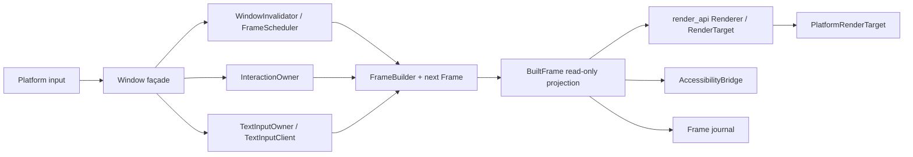

# GPUI: Ownership and Data Flow

GPUI does not use `Rc<RefCell<...>>` scattered through the code. Instead,
every model and view is owned by a single top-level object, the `App`. This
page explains that ownership model and the three ways state changes
propagate: notifications, observations, and events.

## The app owns everything

You start a GPUI application by calling `run` on an `Application`. The
callback receives a mutable reference to the `App`, which owns all
application state and provides access to application services such as
opening windows and presenting dialogs.

```rust
use gpui::{App, AppContext, Application};

Application::new().run(|cx: &mut App| {
    // `cx` is the `App`. All state lives under it.
});
```

## Entities

To put a value under the app's ownership, create it with `cx.new`. This
returns an `Entity<T>` handle. The handle does not hold the value; it is an
identifier plus a compile-time type tag, and the value itself lives in the
app.

```rust
struct Counter {
    count: usize,
}

Application::new().run(|cx: &mut App| {
    let counter: Entity<Counter> = cx.new(|_cx| Counter { count: 0 });
});
```

Cloning an `Entity<T>` is cheap and does not clone the value. The value is
freed when the last handle to it is dropped.

## Reading and updating state

Because the value lives in the app, you need the app to touch it. Use
`read` for a shared reference and `update` for a mutable one. Both take a
callback.

```rust
counter.update(cx, |counter: &mut Counter, _cx| {
    counter.count += 1;
});
```

The callback also receives a `Context<Counter>`, usually named `cx`. A
`Context` is a wrapper around the `App` that is tied to one entity. It
gives you the same application services plus entity-level services, such as
notifications.

## Notifying observers

After you change state, tell GPUI that the entity changed by calling
`cx.notify()`. Anything that observes this entity will be notified.

```rust
counter.update(cx, |counter, cx| {
    counter.count += 1;
    cx.notify();
});
```

`notify` is the signal for "this entity's rendered output may have
changed". Calling it unconditionally is safe, but calling it only when
something actually changed avoids needless work.

## Observing another entity

An entity can watch another entity with `cx.observe`. The callback runs
whenever the observed entity notifies, and receives a handle to it so it
can be read.

```rust
let first: Entity<Counter> = cx.new(|_cx| Counter { count: 0 });

let second = cx.new(|cx| {
    cx.observe(&first, |second: &mut Counter, first: Entity<Counter>, cx| {
        second.count = first.read(cx).count * 2;
        cx.notify();
    })
    .detach();

    Counter { count: 0 }
});

first.update(cx, |counter, cx| {
    counter.count += 1;
    cx.notify();
});

assert_eq!(second.read(cx).count, 2);
```

`observe` returns a `Subscription`. Calling `detach` keeps the observation
alive until one of the entities is dropped. If you store the `Subscription`
instead, dropping it cancels the observation. Dropped `Subscription`s
silently stop firing, so keep the handle when you need the behavior to
persist.

## Emitting typed events

`notify` carries no payload. When an entity needs to broadcast structured
information, implement `EventEmitter<T>` for the event type and call
`cx.emit`.

```rust
use gpui::EventEmitter;

struct Counter {
    count: usize,
}

struct Changed {
    by: usize,
}

impl EventEmitter<Changed> for Counter {}
```

Subscribers use `cx.subscribe` instead of `cx.observe`. The callback
receives the event as well as the emitter.

```rust
let counter: Entity<Counter> = cx.new(|_cx| Counter { count: 0 });

let mirror = cx.new(|cx| {
    cx.subscribe(&counter, |mirror: &mut Counter, _emitter, event: &Changed, cx| {
        mirror.count += event.by * 2;
        cx.notify();
    })
    .detach();

    Counter { count: 0 }
});

counter.update(cx, |counter, cx| {
    counter.count += 2;
    cx.emit(Changed { by: 2 });
    cx.notify();
});

assert_eq!(mirror.read(cx).count, 4);
```

Like `observe`, `subscribe` returns a `Subscription` that you detach or
drop.

## Choosing between the three

| Mechanism      | Use it when                                                    |
| -------------- | -------------------------------------------------------------- |
| `cx.notify()`  | The entity's own rendered output may have changed.             |
| `cx.observe`   | You need to react to another entity changing, with no payload. |
| `cx.subscribe` | Another entity emits a typed event you need to handle.         |

Prefer events when the payload matters, and observations when it does not.
Both are preferable to polling state from a render method.

## Window runtime ownership

`Window` remains GPUI's stable public façade, but it no longer owns every frame, input, text,
accessibility, and renderer algorithm directly. The internal owners divide mutable build-time state
from the completed frame consumed by platform code.



The main boundaries are:

| Module or owner    | Responsibility                                                                 |
| ------------------ | ------------------------------------------------------------------------------ |
| `frame.rs`         | invalidation, scheduling, build stacks, frame cache ranges, completed payloads |
| `interaction.rs`   | hit testing, dispatch, focus/tab, key/action routing, pointer capture          |
| `text_input.rs`    | rendered/next text-input client ownership and candidate geometry               |
| `accessibility.rs` | semantic tree snapshots, stable IDs, advertised actions and action routing     |
| `render_api.rs`    | backend-neutral scene submission and submission outcome                        |
| `platform.rs`      | lifecycle/window/service traits and explicit capability matrices               |
| `window.rs`        | public façade plus draw, present, and lifecycle coordination                   |

During drawing, `FrameBuilder` and the owners mutate only the next frame. At the frame boundary,
GPUI swaps it into the rendered slot and exposes a `BuiltFrame`. `BuiltFrame` borrows the completed
scene and interaction collections, so Rust's shared borrow prevents mutation during synchronous
platform submission without cloning the scene. Accessibility and diagnostics payloads are copied
only where a platform may retain them. Cache replay is internal to the following build and runs
after the completed-frame projection has been released.

Platform operations are capability-gated. Unsupported prompts, clipboard directions, IME
candidate positioning, window controls, lifecycle operations, accessibility, and offscreen
rendering return an explicit unsupported result or are excluded by the façade; they are not silent
no-ops.

## Compatibility boundaries

The refactor retained only compatibility paths with a defined purpose:

- `Window`, `Entity`, `Context`, and the three-stage `Element` API remain source-compatible.
- `PlatformInputHandler` is a deprecated alias for `TextInputClient`. There are zero in-tree
  call sites; the alias is reserved for external platform integrations and is removed at the next
  breaking GPUI release.
- `render_api::submit_platform_frame` is the intentional internal adapter between the
  backend-neutral render contract and the stable `PlatformWindow` façade. EXP-004/005 rejected a
  separate `gpui_render` crate because it would not reduce the dependency graph.
- Full `cx.notify()` invalidation remains authoritative. The scoped-invalidation prototype was
  removed after it produced stale visual/input state or no measurable work reduction.

The execution evidence, experiment budgets, capability matrix, and remaining platform QA are in
the [GPUI refactor progress ledger](./gpui-refactor-progress.md). Native IME repetition steps are in
the [IME validation runbook](./gui-framework-research/ime-validation-runbook.md).

## Where to go next

- [Glossary](./glossary.md) defines the rest of the GPUI vocabulary.
- The `gpui` crate's own rustdoc is the authoritative reference for the
  full API.
