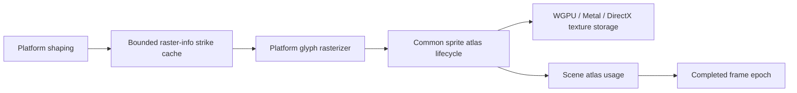

# Text Layout and Fonts

This page records the current state of text layout in ZZZ and an assessment of
moving macOS onto the same backend as Linux. It is an evaluation, not a plan of
record.

## Today

Text layout is provided by the `PlatformTextSystem` trait in
`crates/gpui/src/text_system`. Each platform supplies an implementation:

- **Linux** uses `gpui_wgpu::CosmicTextSystem`
  (`crates/gpui_wgpu/src/cosmic_text_system.rs`), which wraps `cosmic-text`.
- **macOS** uses CoreText directly through `crates/gpui_macos/src/text_system.rs`,
  with `zed-font-kit` for font enumeration and loading.
- **Windows** has its own DirectWrite-based implementation.

So ZZZ is not "a font-kit editor". The Linux path is already cosmic-text; the
split is between platforms, not between libraries.

## What Gram did

Gram moved macOS onto cosmic-text as well, so Linux and macOS share a single
implementation (`crates/gpui/src/text_system/cosmic_text_system.rs` in that
tree). To make that work it maintains its own fork of cosmic-text
(`codeberg.org/GramEditor/cosmic-text`) carrying macOS fixes and
variable-weight font support.

## Benefits

- One shaping, fallback, and bidi implementation to reason about instead of
  one per platform.
- Variable-weight fonts and fallback behavior work identically everywhere.
- Removes `font-kit` from the macOS build, shrinking the dependency graph.

## Costs and risks

- A self-maintained fork of cosmic-text is a standing maintenance burden, and
  it has to be re-based as upstream cosmic-text moves.
- ZZZ tracks upstream Zed closely (see
  [Upstream Cherry-Pick](./upstream-cherrypick.md)). Diverging the macOS text
  backend makes every upstream text-system change a manual port.
- Text rendering is visual and easy to regress in ways unit tests do not
  catch. A migration needs screenshot-based visual tests on macOS before it
  can be trusted.

## Recommendation

Do not migrate now. Track two things:

1. Whether upstream Zed moves its macOS backend toward cosmic-text on its own.
   If it does, ZZZ inherits the work instead of owning it.
2. Whether the macOS `cosmic-text` fork Gram maintains stabilizes and accepts
   contributions, which would lower the cost of a shared implementation.

If the migration is attempted later, do it behind a feature flag so the
CoreText backend remains available as a fallback, and land it with visual
tests rather than as a single large change.

This backend-migration decision is separate from the current glyph raster and
atlas lifecycle work. See
[Text Rendering Architecture Research](./text-rendering-research/report.md) for
the plan to correct subpixel positioning, atlas identity, cache budgets, color
glyph formats, and texture sampling without replacing the platform shapers.

## Rendering and atlas architecture

The refactor keeps those three shaping backends, but the raster and GPU
residency contract is now shared:

- `GlyphRasterInfo` is the authority for bounds and Alpha8, subpixel BGRA8, or
  straight-alpha color BGRA8. `is_emoji` is only a source-selection hint.
- `TextSystem` caches metadata in byte/count-bounded strikes. Glyph pixels are
  rerasterized on an atlas miss instead of being retained in a second CPU
  bitmap cache.
- The common atlas owns page allocation, content-class budgets, LRU,
  whole-page compaction, stable identities, retirement, and epoch changes.
  Backends only create, upload, destroy, and resolve textures.
- Every tile has a one-device-pixel gutter. Coverage and SVG masks use
  transparent padding; ordinary images extrude their edge pixels. The shader
  still samples only the inner content bounds.
- A completed frame records atlas usage. Removing or evicting content advances
  the atlas epoch at a frame boundary and prevents stale cached paint replay.

The implementation evidence, experiments, cross-platform runbooks, and raw
artifact hashes are recorded in the
[text rendering refactor progress ledger](./text-rendering-refactor-progress.md).
