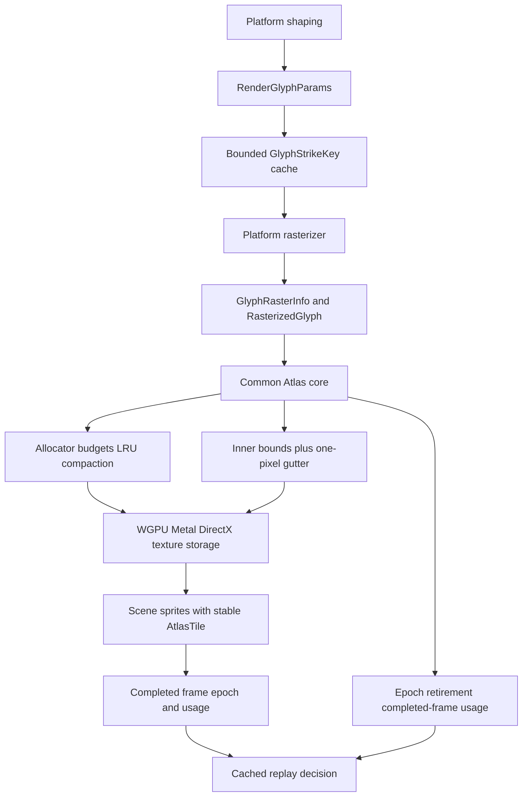
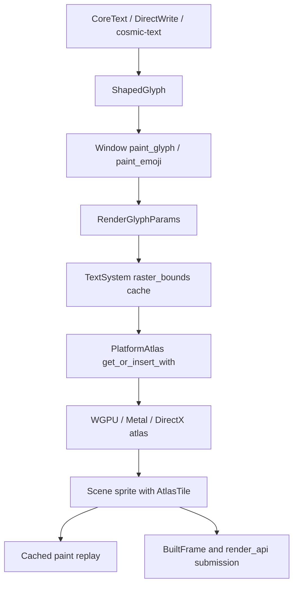
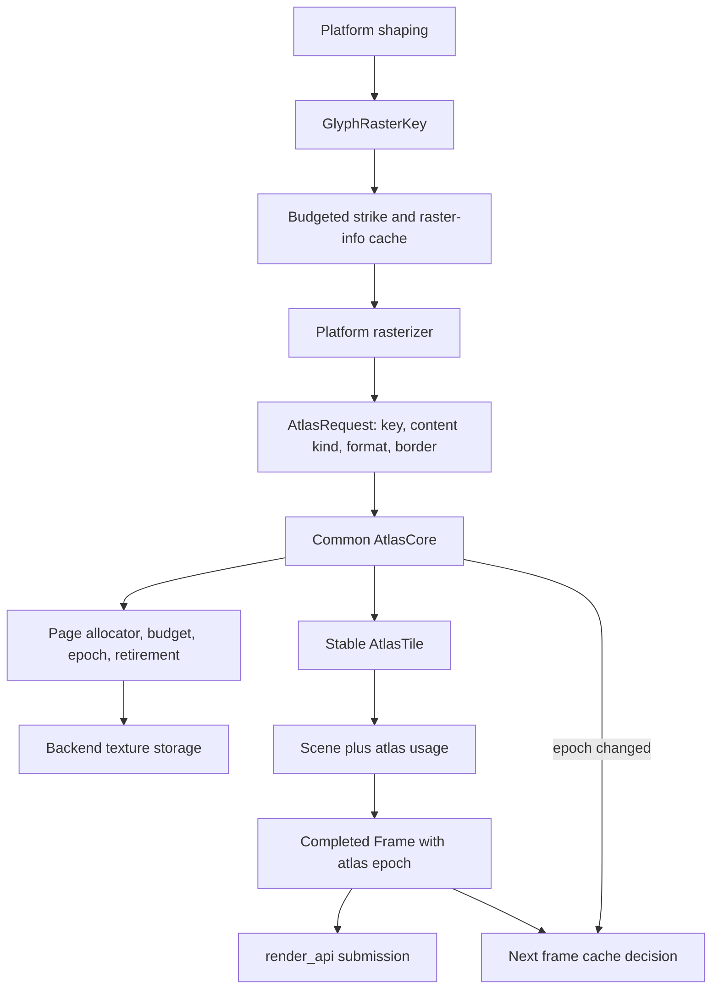

# GPUI 文本渲染与字形缓存架构研究

本文基于当前 ZZZ、Skia 和 rust-skia 源码，定义 GPUI 文本与 sprite atlas
重构的目标架构。它回答“应该从 Skia 学什么”，不建议把 Skia 作为新的生产运行时
依赖。

- ZZZ：`a3a0f9734069b543f3fe1e0bdd77a37fbd1b2b31`
- Skia：`84068ebf574dd6c8503ac3e6a02a1ff2f0633fbd`
- rust-skia：`594bb85bad45777ff5f7e284ba54c51346fb9e2e`
- 检查时间：2026-10-06
- 证据：[evidence.tsv](./evidence.tsv)
- 实验：[experiments.tsv](./experiments.tsv)
- 执行合同：[refactoring-plan.md](./refactoring-plan.md)
- 执行账本：[../text-rendering-refactor-progress.md](../text-rendering-refactor-progress.md)

## 实施结果（2026-10-07） {#implementation-outcome}

本报告以下“当前实现”和风险定位保留为计划基线
`a3a0f9734069b543f3fe1e0bdd77a37fbd1b2b31` 的历史证据。重构已在
`refactor/gpui-text-rendering` 上完成阶段 0–9；阶段 8 根据 TEXT-010 拒绝 upload
batching，阶段 9 的 Linux hardware/fallback runtime、TEXT-011、文档和全 workspace
验证已收敛。macOS/Windows native runtime 按合同标记 `NOT RUN` 并提供精确 runbook。

已实现的生产架构：



| 领域                  | 最终结果                                                                 |
| --------------------- | ------------------------------------------------------------------------ |
| subpixel              | integer tick + Euclidean decomposition，负坐标和正相位逐像素一致         |
| atlas identity        | monotonic texture/tile IDs、tombstone、whole-page recovery，无 ABA reuse |
| residency             | content-class budgets、working-set floor、LRU 与 whole-page compaction   |
| raster format         | raster result 决定 Alpha/Subpixel/Color；color 是 straight-alpha BGRA8   |
| color fonts           | WGPU COLRv1/SVG/bitmap、CoreText capability、DirectWrite native color    |
| sampling              | glyph/SVG transparent gutter、image edge extrusion、DirectX clamp        |
| CPU metadata cache    | bounded two-level strike cache；不缓存第二份 bitmap                      |
| upload batching       | `REJECTED`：2.41× byte amplification，无 frame p95 实质收益              |
| production dependency | 未引入 Skia/rust-skia，未增加默认网络下载                                |

所有实验原始 artifact、平台 runbook、signed commit 和验证状态见执行账本。

## 结论 {#decision}

GPUI 不应引入 Skia 或 rust-skia 作为生产渲染依赖。当前实现已经有平台 shaping、
四档水平子像素、灰度/彩色/LCD texture format、GPU atlas、Gamma/对比度校正和
真实 headless renderer。缺口集中在资源身份、缓存生命周期和跨平台 raster contract，
不是缺少一套 2D API。[TR-ZZZ-013, TR-ZZZ-021, TR-ZZZ-022]

重构应按以下优先级推进：

1. 修复负坐标子像素分解。
2. 消除 atlas tile 和 texture slot 的 ABA 错图风险。
3. 建立 frame-aware atlas epoch、retirement 和 cache replay 失效协议。
4. 将公共 page allocator、预算和压缩算法从三个 GPU backend 中提取出来。
5. 用实际 raster format 决定 glyph atlas，而不是让 `is_emoji` 决定像素格式。
6. 为 linear sampling 增加正确的 gutter policy。
7. 把无限增长的 raster-bounds map 改成有预算的 strike/raster-info cache。
8. 只在实验支持时增加 upload coalescing；不为了“像 Skia”而增加常驻 CPU page
   mirror。

Skia 最值得借鉴的是 generation、token-protected reuse、预算、LRU/compaction、
strike 分层和 bilinear gutter。[TR-SKIA-002, TR-SKIA-003, TR-SKIA-005,
TR-SKIA-007] 不应直接照搬它的固定四页上限，因为 GPUI 一次提交完整 `Scene`，没有
Skia 在 atlas 满时结束当前 draw pass 并重试的机制。[TR-SKIA-004]

## 基线执行链路 {#current-flow}



`BuiltFrame` 已经把完成帧作为只读 projection 交给 platform/rendering code，这给
atlas 生命周期提供了合适的 frame boundary。[TR-ZZZ-001] GPU recovery 也已经证明
“资源失效后强制 full refresh、禁止 cached replay”是现有架构认可的恢复方式。
[TR-ZZZ-002]

问题是 atlas 不参与这个 frame contract。`Scene::replay` 会直接复制旧
`AtlasTile`，而 atlas remove、slot reuse 和新 allocation 完全独立进行。
[TR-ZZZ-003, TR-ZZZ-007]

## 代码异味和正确性风险 {#findings}

### P0：负坐标子像素分解错误 {#negative-subpixel}

定位：`crates/gpui/src/window.rs:3844`。

`Window::paint_glyph` 先量化到四分之一像素，再使用 `fract()` 取 variant、
`trunc()` 取整数坐标。[TR-ZZZ-004]

对 `-0.25`，正确表示是：

```text
integer = -1
variant = 3
reconstructed = -1 + 3 / 4 = -0.25
```

当前分解不能保留这个相位，可能在水平滚动、负向 transform 或窗口左侧裁剪附近
造成字形跳动。[TR-ZZZ-005]

Skia 使用两个 subpixel bit，并通过 `floor` 规范化负坐标。[TR-SKIA-001]
GPUI 应使用整数 tick 和 `div_euclid`/`rem_euclid`，不要继续组合浮点
`fract`/`trunc`。

### P0：atlas 资源存在 ABA 错图风险 {#atlas-aba}

定位：`crates/gpui/src/scene.rs:141`、`crates/gpui/src/window.rs:4202`、
`crates/gpui_wgpu/src/wgpu_atlas.rs:140`、
`crates/gpui_wgpu/src/wgpu_atlas.rs:216`；Metal 和 DirectX 有同构实现。

当前缓存链路同时具备三个条件：

1. cached paint replay 保留旧 `AtlasTile`；
2. remove 立即释放 tile allocation；
3. backend 会复用 texture-list index 和 etagere allocation。

[TR-ZZZ-003, TR-ZZZ-010, TR-ZZZ-011]

renderer 只用 `AtlasTextureId` 找 texture，再用旧 bounds 采样。它不验证原
`AtlasKey`。因此旧 Scene 理论上可能从同一个 slot 或矩形读到后来上传的其它内容，
表现为错图，而不是安全的 cache miss。[TR-ZZZ-012]

只给 texture 增加 generation 不够，因为同一 texture 内的 suballocation 也会复用。
正确方案需要同时满足：

- `AtlasTextureId` 和 `TileId` 在 atlas 生命周期内单调唯一，不复用旧身份；
- remove/eviction 先进入 retirement，不能立即让 allocation 可复用；
- atlas epoch 变化后，下一个 frame 必须禁止 paint replay；
- retired suballocation 不再单独回到 allocator；只有整页换新并分配新的 texture ID
  才能回收空间。

整页 retirement 避免在旧 GPU command buffer 仍可能采样时就地覆盖同一 texture
region，也避免为了第一版正确性先引入跨 WGPU、Metal 和 DirectX 的 fence abstraction。

### P1：GPU atlas 是多页容器，不是有界缓存 {#unbounded-atlas}

定位：`crates/gpui/src/platform.rs:1333`、
`crates/gpui_wgpu/src/wgpu_atlas.rs:156`。

WGPU、Metal 和 DirectX 都会在现有 texture 放不下时追加新 page，没有 byte budget、
page limit、recency 或 automatic eviction。[TR-ZZZ-007, TR-ZZZ-009]

这对大量 CJK、多个字号、多个 scale factor、彩色 glyph 和长期运行会造成 resident
GPU memory 持续增长。固定硬上限也不正确，因为当前 `Scene` 的可见 working set
可能本身超过上限。

目标应是：

```text
resident bytes <= max(configured retained-cache budget,
                      current completed-frame working set)
                  + one compaction page
```

预算限制“保留缓存”，不能牺牲当前帧正确性。单帧 working set 超预算时允许临时
超出，并在后续 full refresh/compaction 中收敛。

### P1：像素格式和内容生命周期被混为一谈 {#content-class}

定位：`crates/gpui/src/platform.rs:1264`。

`AtlasTextureKind` 正确表达了 `Monochrome`、`Polychrome` 和 `Subpixel` 像素格式。
[TR-ZZZ-013] 但同一 format pool 同时保存：

- monochrome glyph 和 SVG mask；
- color glyph 和普通 image；
- LCD glyph。

这些内容的大小、重建成本和删除语义不同。大 image 不应驱逐 glyph working set，
频繁 CJK glyph 也不应改变 image 生命周期。

应新增独立的 `AtlasContentKind`：

```text
GlyphAlpha
GlyphSubpixel
GlyphColor
SvgMask
Image
```

`AtlasTextureKind` 继续决定 GPU format，`AtlasContentKind` 决定预算、padding、
eviction 和 diagnostics。

### P1：三个 backend 重复拥有 allocator policy {#backend-duplication}

定位：`crates/gpui_wgpu/src/wgpu_atlas.rs:156`、
`crates/gpui_macos/src/metal_atlas.rs:98`、
`crates/gpui_windows/src/directx_atlas.rs:133`。

三个 native backend 都实现自己的 texture list、etagere allocator、free list、
live-key count、page creation 和 deallocation。[TR-ZZZ-023]

这让生命周期修复必须复制三次，也容易出现平台差异。allocator、page metadata、
budget、retirement 和 compaction 应归 `gpui` 的公共 atlas core；backend 只负责：

- 创建指定 format/size 的 GPU texture；
- 上传指定 region；
- 销毁 texture；
- 暴露 renderer 需要的 texture view/resource。

这是一个新的逻辑组件，适合从 `platform.rs` 移到单独的 `atlas.rs`。公开 façade
仍从 `gpui` root re-export，避免消费方迁移。

### P1：raster contract 让 Emoji 语义决定像素格式 {#raster-format}

定位：`crates/gpui/src/platform.rs:1274`、
`crates/gpui_macos/src/text_system.rs:415`、
`crates/gpui_wgpu/src/cosmic_text_system.rs:386`。

macOS 只识别两个 Apple Color Emoji 名称，WGPU 只识别两个已知字体名称。
[TR-ZZZ-018, TR-ZZZ-019] Windows 已经按 glyph 查询 DirectWrite 支持的 color
formats。[TR-ZZZ-020]

`is_emoji` 可以保留为 shaping/source preference hint，但不能再决定 atlas format。
平台 raster API 应返回：

```rust
struct GlyphRasterInfo {
    bounds: Bounds<DevicePixels>,
    format: GlyphRasterFormat,
}

struct RasterizedGlyph {
    info: GlyphRasterInfo,
    pixels: Vec<u8>,
}

enum GlyphRasterFormat {
    Alpha8,
    SubpixelBgra8,
    ColorBgra8,
}
```

WGPU 使用 Swash `Image::content` 作为权威格式；Windows 保留 per-glyph
DirectWrite 路径；macOS 至少改用 CoreText color-glyph trait，而不是 PostScript
name。对 color-capable font 采用保守 RGBA 路径即使多占内存，也比 tint 错误更安全。

### P1：linear sampling 没有 gutter {#atlas-gutter}

定位：`crates/gpui_wgpu/src/wgpu_renderer.rs:320`、
`crates/gpui_wgpu/src/wgpu_atlas.rs:338`。

三个 GPU backend 都使用 linear sampling，而 tile padding 为零。
[TR-ZZZ-016] 缩放、transform 和 UV 边界会让 bilinear footprint 读取相邻 tile。

Skia 在允许 bilinear glyph atlas 时增加一像素透明边界。[TR-SKIA-007] GPUI 已有
未使用的 `AtlasTile::padding` 字段，应该赋予它实际语义：

- glyph/SVG coverage：一像素透明 gutter；
- ordinary image：一像素 edge extrusion，避免图像边缘出现透明细线；
- `tile.bounds` 始终表示 inner content bounds；
- allocator 和 upload 使用 outer padded bounds。

不能全局把 sampler 改成 nearest，因为 SVG、image 和 transformed text 仍需要
linear sampling。DirectX address mode 应从 `WRAP` 改为 `CLAMP`，作为 texture
edge 的防御，不替代 tile gutter。

### P1：CPU raster-bounds cache 永久增长 {#cpu-strike-cache}

定位：`crates/gpui/src/text_system.rs:50`、
`crates/gpui/src/text_system.rs:341`。

line layout 已经采用 previous/current frame cache，而 raster bounds 是
application-lifetime flat map。[TR-ZZZ-014, TR-ZZZ-015]

目标不是复制 Skia 的所有 `SkGlyph` 能力，而是建立适合 GPUI 的两级 cache：

```text
GlyphStrikeKey
  font_id
  font_size bits
  scale_factor bits
  synthetic style
  text rendering mode
  platform coverage parameters

PackedGlyphKey
  glyph_id
  subpixel x/y variant
```

第一版只缓存 `GlyphRasterInfo`，同时限制 strike count 和估算 bytes。不要默认保留
第二份 glyph bitmap；GPU eviction 后按需重新 rasterize。只有实验表明 raster cost
成为瓶颈时，才增加单独有预算的 bitmap tier。Skia 的 byte/count LRU 和 strike 分层
证明了方向，但不是要求复制其内存布局。[TR-SKIA-002]

### P2：miss builder 在 atlas lock 内运行 {#builder-lock}

定位：`crates/gpui/src/platform.rs:1310`、
`crates/gpui/src/platform.rs:1363`。

atlas miss closure 包含字体 rasterization，却在 atlas mutex 内执行。
[TR-ZZZ-008] 公共 atlas core 应采用：

1. lock 后查询；
2. miss 时释放 lock 并构建 pixels；
3. 重新 lock；
4. double-check；
5. 插入或复用另一线程已插入的 entry。

这样不会把平台字体 API 或较大 image copy 放在 atlas critical section 中。

### P2：upload 粒度可优化，但必须实验决定 {#uploads}

定位：`crates/gpui_wgpu/src/wgpu_atlas.rs:248`。

WGPU 延迟 upload，却仍对每个 entry 单独调用 `write_texture`。
[TR-ZZZ-017] Skia 使用 plot CPU backing store 和 dirty rectangle 合并 upload。

GPUI 不应未经测量就引入等同 GPU atlas 大小的常驻 CPU mirror。优先实验以下顺序：

1. 单 staging buffer、多 copy command；
2. 同页相邻 region 合并；
3. 只有收益明确时才考虑 page/plot mirror。

拒绝 upload batching 也是阶段完成结果，只要实验和理由记录完整。

## 目标架构 {#target-architecture}



建议的所有权边界：

| 所有者       | 职责                                                                   |
| ------------ | ---------------------------------------------------------------------- |
| `TextSystem` | shaping façade、strike/raster-info cache、platform rasterizer          |
| `atlas.rs`   | keys、content/format、page allocator、budget、epoch、retirement、stats |
| `Scene`      | sprite primitives 和本帧引用的 atlas tile/page usage                   |
| `Frame`      | 完成帧的 atlas epoch 和 usage snapshot                                 |
| `Window`     | begin/finish frame 协调；epoch 不匹配时 full refresh                   |
| GPU backend  | texture create/upload/destroy 和 renderer resource lookup              |

## 必须保持的不变量 {#invariants}

1. 旧 `Scene` 永远不能把旧 tile identity 解析成新内容。
2. atlas epoch 变化后，任何 cached paint range 都不能 replay。
3. remove 和 eviction 不会立即复用仍可能被 completed frame 引用的 allocation。
4. retired tile 形成 tombstone；空间只通过使用新 texture ID 的整页 compaction 回收。
5. 当前帧完整 working set 优先于 cache budget；预算不能制造缺字。
6. budget 按 resident GPU page bytes 计算，不按已占 glyph area 猜测。
7. pixel format 与 content lifecycle 分离。
8. `tile.bounds` 只表示 content；padding 不泄漏进布局尺寸。
9. raster format 由 rasterizer 的结果决定，不由 Emoji 字体名称决定。
10. Gamma/contrast 只能在一个明确阶段应用，不能 platform raster 和 shader 双重校正。
11. device loss、explicit remove 和 budget eviction 使用同一 epoch/full-refresh 协议。
12. 默认构建不增加 frame event buffer 或昂贵 diagnostics allocation。
13. 公开 `gpui` façade、`Window`、`PlatformAtlas` 和 sprite API 尽量保持兼容；内部
    类型移动通过 root re-export 隔离。

## 采用与拒绝的 Skia 设计 {#skia-decisions}

| Skia 设计                       | 决定         | GPUI 处理                                       |
| ------------------------------- | ------------ | ----------------------------------------------- |
| 两位 subpixel packed position   | 采用         | 使用 Euclidean integer tick 分解                |
| atlas generation                | 采用         | epoch 进入 completed-frame cache contract       |
| last-use token                  | 采用概念     | 使用 completed-frame usage 和 retirement        |
| byte/count strike limits        | 采用         | 有预算的 raster-info strike cache               |
| A8/color/LCD 分离               | 已存在       | 保留并与 content class 解耦                     |
| bilinear 一像素 padding         | 采用         | coverage 透明边界，image edge extrusion         |
| 固定最多四页                    | 拒绝直接照搬 | 使用 working-set floor 加 retained-cache budget |
| plot CPU mirror                 | 拒绝         | TEXT-010 staging bytes 放大 2.41×               |
| rust-skia production dependency | 拒绝         | 只允许 `.tmp` oracle experiment                 |

rust-skia 的 `StrikeRef` 和 `SurfaceProps` 可以做离线 metrics/pixel 对照，但它没有
暴露可直接复用的 Graphite atlas；默认 build 还可能下载预编译二进制。
[TR-RUSTSKIA-001, TR-RUSTSKIA-002, TR-RUSTSKIA-003]

## 证据边界与剩余平台验证 {#unknowns}

- Linux/WGPU hardware 与 llvmpipe 已运行完整 headless experiments；macOS/Metal 和
  Windows/DirectX native runtime 在当前 Linux 主机标记 `NOT RUN`，执行账本提供 tracked
  fixtures、命令和判定阈值。
- CoreText 对 color-capable font 采用保守 font-level RGBA；DirectWrite 保留 per-glyph
  detection。该差异是明确的平台 capability 边界，不再依赖 PostScript 名称决定 atlas
  format。
- TEXT-010 在 WGPU 首关因 2.41× byte amplification 失败，因此未把结果外推为
  Metal/DirectX batching 结论，也没有在这些 backend 保留实验代码。
- Gamma/contrast 公式未重写；TEXT-007 证明 color glyph 不被 text tint，coverage glyph
  继续由现有 shader correction 处理。

最终验证状态见[执行账本](../text-rendering-refactor-progress.md)。
