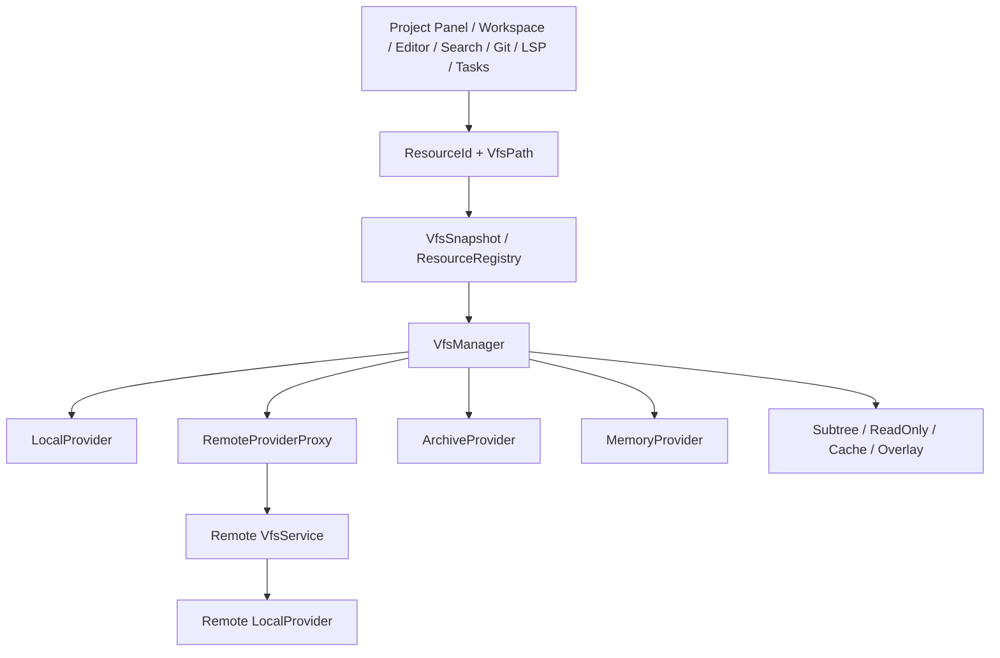

# ZZZ VFS 架构研究与目标设计

本文定义 ZZZ 文件系统重构的目标架构。它回答为什么要重构、哪些现有实现值得
参考、哪些 Rust 库可以使用，以及本地、远程、ZIP 和未来虚拟资源如何进入同一套
模型。

- 研究基线：ZZZ `6500fbdeccd7d523acfc69161d6371b631fdb6ac`
- 检查日期：2026-10-05
- 来源：[sources.tsv](./sources.tsv)
- 证据：[evidence.tsv](./evidence.tsv)
- 实验门槛：[experiments.tsv](./experiments.tsv)
- 实施合同：[refactoring-plan.md](./refactoring-plan.md)
- 可复制 Goal：[goal.md](./goal.md)

如果执行时 HEAD 已变化，先审查 `crates/fs`、`crates/worktree`、`crates/project`、
`crates/workspace`、`crates/editor`、`crates/proto`、`crates/rpc` 和远程开发相关提交，
再更新执行基线。不得为了回到本文 revision 而重置或丢弃用户工作。

## 1. 结论 {#decision}

ZZZ 应拥有自己的 IDE 级 VFS。没有一个已检查的 Rust crate 能同时正确覆盖：

- Linux、macOS、Windows、WSL、Docker 与 SSH remote development；
- 无损 POSIX byte path 与 Windows native path；
- 大型目录惰性加载、文件监听、overflow 恢复和断线续传；
- Editor、Project Panel、Search、Git、LSP、Tasks 和媒体查看器；
- ZIP、memory、subtree、read-only、cache 与 overlay 等组合式 provider；
- 稳定文件身份、重命名、删除、缓存失效和跨会话持久化。

这一结论仅针对本报告列出的、已检查的候选与 ZZZ workload，不声称穷尽 Rust
生态。[SYN-001]

目标架构组合三类成熟经验：

1. **VS Code provider 与 remote proxy。** 文件系统通过统一接口和 capability 暴露，
   远程 provider 是服务端本地 provider 的 IPC 代理。[VSC-001][VSC-002]
2. **IntelliJ provider 与 snapshot 分离。** provider 读取真实状态，VFS snapshot
   管理稳定身份、惰性目录、缓存与 refresh。[IJ-001][IJ-002]
3. **rust-analyzer I/O 与 analysis 分离。** 代码分析只消费 `FileId` 和内容变化，不
   直接执行文件 I/O。[RA-001][RA-002]

第三方库只能进入 provider 内部，不能成为 ZZZ 的公开资源模型。

## 2. 当前架构问题 {#current-problems}

### 2.1 `Fs` 聚合了不属于同一层的职责 {#fs-responsibilities}

当前 `Fs` 同时包含：

- 文件与目录 CRUD；
- whole-file load/save；
- watcher；
- trash 与 restore；
- Git repository、clone、config；
- tar extraction；
- job notifications。

这使 storage provider 无法保持小而可组合，也迫使 fake/local provider 实现与文件
系统无关的服务。[ZZZ-001]

目标架构必须拆分：

- `VfsProvider`：资源和字节 I/O；
- `VfsSnapshot`：身份、树和一致性；
- `GitService`：Git repository 和命令；
- `ProcessService`：远程任务、命令与 job；
- `ArchiveProvider`：压缩容器；
- `TrashService` 或 provider capability：平台 trash/restore。

### 2.2 本地与远程是行为分支，不是 provider 差异 {#local-remote-split}

`Worktree` 当前分为 `LocalWorktree` 和 `RemoteWorktree`。二者共享 snapshot 形状，
但读取、写入、扩展目录和传输文件走不同分支。[ZZZ-002]

这会持续产生专用 RPC：buffer、image、download 和其它媒体各自实现远程传输。
目标架构让远程只成为 `RemoteProviderProxy`。Project、Workspace 和 Editor 不再通过
`is_local()` 决定文件操作路径。

### 2.3 路径表示不是无损跨平台协议 {#path-limitations}

当前 `RelPath`：

- 强制合法 Unicode；
- 把 Windows separator 转成 `/`；
- 通过 protobuf `string` 传输；
- `ProjectPath` 只包含 `WorktreeId + RelPath`。
  [ZZZ-003][ZZZ-004][ZZZ-005][ZZZ-007]

这无法完整表示 POSIX 非 UTF-8 文件名，也不能作为任意 Windows `OsString` 的稳定
wire representation。路径显示与操作身份也没有分离。

### 2.4 LSP 与 native path 耦合 {#lsp-native-path}

ZZZ 当前只把有本地 `file:` URI 的文件注册给 language server，明确不支持非文件
URI。[ZZZ-006] 完整 VFS 不应强迫 ZIP、memory 或 extension provider 伪装成物理
路径。LSP mapping 必须成为独立能力。

## 3. 参考实现结论 {#references}

### 3.1 VS Code {#vscode}

值得采用：

- scheme/provider 注册；
- 细粒度 capability；
- whole-file、stream 和 positioned handle I/O；
- remote provider 与 local provider 同接口；
- cancellation、session watcher 和 request correlation；
- provider-aware URI identity。[VSC-001][VSC-002][VSC-003]

不直接采用：

- 用 URI string 作为全部内部身份；
- 只用 provider-wide case sensitivity 表达所有目录；
- JavaScript/Extension Host 特有的动态边界。

### 3.2 IntelliJ Platform {#intellij}

值得采用：

- provider 只负责真实数据访问；
- snapshot 管理 stable virtual file identity；
- metadata、directory children 和 content 分开惰性加载；
- watcher 作为 refresh hint，不把 watcher event 当最终真相；
- archive filesystem 与 local/remote routing 进入同一上层模型。
  [IJ-001][IJ-002][IJ-003]

不直接采用：

- 没有明确上限的 application-global persistent cache；
- Java/NIO 特有接口；
- 同步 refresh 和 IDE write action 模型。

### 3.3 rust-analyzer {#rust-analyzer}

rust-analyzer VFS 不执行 I/O。它 intern path，生成 `FileId`，合并 create、modify 和
delete changes，再把 delta 交给增量数据库。loader 独立负责读取和 watching。
[RA-001][RA-002]

ZZZ 应在 language/index 层采用这条边界：分析服务只能消费 resource snapshot 和
content delta，不能直接依赖 local/remote/archive provider。

### 3.4 Lapce {#lapce}

Lapce 的 remote proxy 证明 Git、LSP、watch 和文件访问应在数据所在主机运行。
[LAP-002] 但它直接在 RPC 中使用 `PathBuf`，不适合作为跨不同 host OS 的严格
路径协议。[LAP-001]

### 3.5 Rust 库 {#rust-libraries}

| 候选                | 可采用部分                                                              | 不适合作为核心的原因                                                           | 决策                                                         |
| ------------------- | ----------------------------------------------------------------------- | ------------------------------------------------------------------------------ | ------------------------------------------------------------ |
| `typed-path`        | host-independent Unix/Windows lexical parsing、byte paths、checked join | 不提供 provider、watch、remote、identity 或完整 Windows wire encoding          | 包装后采用 [TP-001][TP-002]                                  |
| `cap-std`           | capability root、symlink/path traversal containment                     | local blocking API，不是 VFS                                                   | 用于安全敏感的 local/subtree provider [CAP-001]              |
| `notify`            | 跨平台 watcher backend                                                  | 平台和文件系统事件可能缺失、变化或需要 polling fallback                        | 保留在 `LocalProvider` 内部 [NOTIFY-001][NOTIFY-002]         |
| `async_zip`         | seekable ZIP index 与单 entry 解压                                      | 只有 ZIP 数据层                                                                | 用于 `ArchiveProvider` [AZIP-001]                            |
| OpenDAL             | capability、layer、range read、SFTP/object store、behavior tests        | UTF-8 slash path、object-storage 语义、无 IDE watcher、相关 backend 使用 Tokio | 仅作为 optional provider adapter [ODA-001][ODA-002]          |
| `remotefs`          | runtime-neutral remote streams、range/seek、协议族                      | 无 local/snapshot/watch；普通远程开发不应绕过 ZZZ server                       | agentless remote URL 的 optional provider [RFS-001][RFS-002] |
| Wasmer `virtual-fs` | mount tree、overlay、whiteout、memory/host FS                           | WASI/Tokio 取向，无 IDE refresh 与 remote identity                             | 只参考算法 [WAS-001]                                         |
| `rust-vfs`          | 小型 memory/physical/overlay test abstraction                           | UTF-8 path、sync-first、async 计划移除、无 watcher/remote，ZIP 仍是 roadmap    | 不采用 [RVFS-001][RVFS-002][RVFS-003]                        |

## 4. 目标架构 {#target-architecture}



### 4.1 身份与路径 {#identity-and-paths}

核心类型必须区分：

```rust
pub struct MountId(u64);

pub struct ResourceId {
    pub mount_id: MountId,
    pub node_id: u64,
    pub generation: u32,
}

pub struct VfsPath {
    pub mount_id: MountId,
    pub relative: NormalizedRelativePath,
}

pub enum PathEncoding {
    UnixBytes,
    WindowsWtf8,
    PortableUtf8,
}
```

强制不变量：

1. `VfsPath` 永远相对 mount root。
2. component 无损存储；display string 是单独字段，可以 lossy。
3. component 不包含 separator、NUL、未解析 `.` 或 `..`。
4. join 不允许 absolute replacement 或越过 mount root。
5. protobuf 使用 `bytes + PathEncoding`，不能把 native path 压成 `string`。
6. URI 只用于 persistence、plugin 和 LSP interoperability，不是 primary key。
7. provider 返回每个目录项的 `lookup_key`。Snapshot 用该 key 比较名称，避免在
   客户端错误模拟 Windows/macOS case folding。
8. directory metadata 可以覆盖 mount 默认 case sensitivity，支持 Windows
   per-directory case-sensitive state。

`typed-path` 可用于 lexical parser，但 ZZZ 需要自己的 wrapper 与 wire codec。

### 4.2 Provider {#provider}

Provider API 保持 object-safe、async 和 capability-led：

```rust
#[async_trait::async_trait]
pub trait VfsProvider: Send + Sync {
    fn descriptor(&self) -> &ProviderDescriptor;
    fn capabilities(&self) -> ProviderCapabilities;

    async fn stat(
        &self,
        path: &ProviderPath,
        options: StatOptions,
    ) -> VfsResult<EntryMetadata>;

    async fn read_dir(
        &self,
        path: &ProviderPath,
        request: DirPageRequest,
    ) -> VfsResult<DirPage>;

    async fn open(
        &self,
        path: &ProviderPath,
        options: OpenOptions,
    ) -> VfsResult<Arc<dyn VfsFile>>;

    async fn create_dir(
        &self,
        path: &ProviderPath,
        options: CreateDirOptions,
    ) -> VfsResult<()>;

    async fn remove(
        &self,
        path: &ProviderPath,
        options: RemoveOptions,
    ) -> VfsResult<RemoveOutcome>;

    async fn rename(
        &self,
        source: &ProviderPath,
        target: &ProviderPath,
        options: RenameOptions,
    ) -> VfsResult<()>;

    async fn copy(
        &self,
        source: &ProviderPath,
        target: &ProviderPath,
        options: CopyOptions,
    ) -> VfsResult<()>;

    async fn watch(
        &self,
        request: WatchRequest,
    ) -> VfsResult<BoxStream<'static, VfsResult<EventBatch>>>;
}
```

基础 file primitive 使用 positioned I/O：

```rust
#[async_trait::async_trait]
pub trait VfsFile: Send + Sync {
    async fn len(&self) -> VfsResult<u64>;
    async fn read_at(&self, offset: u64, buffer: &mut [u8])
        -> VfsResult<usize>;
    async fn write_at(&self, offset: u64, buffer: &[u8])
        -> VfsResult<usize>;
    async fn set_len(&self, len: u64) -> VfsResult<()>;
    async fn flush(&self) -> VfsResult<()>;
    async fn sync(&self) -> VfsResult<()>;
}
```

`read_at` 可以直接映射 Unix `pread`、Windows `seek_read`、SFTP range 与远程 RPC。
它避免共享 cursor 锁，支持并行 I/O，也适合读取 ZIP Central Directory。需要
`AsyncRead + AsyncSeek` 的 decoder 使用上层 adapter。

### 4.3 Capability {#capabilities}

Capability 需要同时表达支持情况和约束：

- whole-file、stream、positioned read；
- write、append、truncate、set length；
- atomic read/write/delete；
- conditional write、expected version、idempotency；
- list pagination、recursive list、stat-many；
- same-mount rename/copy 与 cross-mount fallback；
- symlink、hardlink、readlink、permissions、executable bit、xattrs；
- watch、recursive watch、resumable journal；
- trash/restore、native path、stable provider file key；
- case-sensitive、case-insensitive、per-directory case behavior；
- maximum page、batch、range 与 request sizes。

使用结构体而不是只有 bitflags。调用者不能通过试错推断 capability，也不能把
unsupported 当作成功 no-op。

### 4.4 Metadata 与 version {#metadata-version}

`EntryMetadata` 至少包含：

- `EntryKind`: file、directory、symlink、special；
- exact name、display name、lookup key；
- size、mtime、ctime、permissions；
- optional provider file key；
- content version 与 structure version；
- symlink target 与 follow state；
- writable/private/hidden/executable；
- directory case behavior。

Version 是 provider opaque value，不能只依赖 timestamp。Write、rename 和 delete
允许传 `expected_version`，遇到并发变化返回 `StaleVersion`，不能覆盖新内容。

### 4.5 Error model {#errors}

所有 provider 与 RPC 共享可序列化错误：

- not found、already exists；
- not a directory、is a directory；
- permission denied、read-only；
- unsupported、invalid path；
- conflict、stale version；
- disconnected、cancelled、timeout；
- quota、too large；
- corrupt data、watch overflow；
- provider/internal error，保留 source chain 供日志使用。

UI 只显示可行动信息；日志保留 provider、mount、operation 和 request ID。不得把
原始凭据或不应共享的路径写入遥测或协作消息。

## 5. Snapshot 与一致性 {#snapshot}

`VfsSnapshot` 位于 provider 之上，拥有：

- session-stable `ResourceId`；
- `ResourceId ↔ current VfsPath` 映射；
- optional provider file key；
- 惰性 directory children 和 metadata；
- fresh、stale、loading、tombstone 状态；
- content/structure version；
- bounded metadata、directory 和 range cache；
- event sequence、watch cursor 和 rescan state。

Watcher event 只是 hint。任何 provider 都可能：

- 合并或重复事件；
- 丢失中间事件；
- 无法可靠识别 rename；
- overflow；
- 在断线后失去 journal。

因此必须：

1. 先注册 watch，再进行 initial scan。
2. 每批事件携带单调递增 sequence。
3. 能续传时从 `resume_after_sequence` 继续。
4. 无法续传时显式产生 `Overflow`。
5. Snapshot 对最小受影响 root rescan 并计算 deterministic diff。
6. 只有 diff 应用完成后才向消费者发布一致 snapshot。

缓存必须有容量与 eviction；不能复制 IntelliJ 永久增长的全局 snapshot。

## 6. 远程协议 {#remote-protocol}

正常 remote development 继续在远程主机运行 ZZZ server，不改成 UI 进程直接
SFTP。客户端注册 `RemoteProviderProxy`，服务端运行同一套 `VfsManager`、
`VfsSnapshot` 与 `LocalProvider`。

协议必须支持：

- mount descriptor、path encoding 和 capability negotiation；
- `stat_many` 与 paged `read_dir`；
- open/close handle 与 positioned read/write；
- bounded stream、backpressure 和 cancellation；
- operation ID、idempotency key 与 expected version；
- watch subscription、sequence、resume 和 overflow；
- protocol version negotiation；
- additive fields 与 unknown capability preservation；
- server-side root containment、authorization 和 private-file checks；
- request/response size limits。

远程 transport 不得把一个大文件强制收集进单个 `Vec<u8>`。RPC Task 必须 await、
detach 或存储，连接关闭时必须取消并释放 handle。

## 7. Data-local provider composition {#data-local-composition}

包装另一个 resource 的 provider 应在数据所在主机执行。远程 ZIP 流程：

1. 客户端发送 `MountArchive(source_resource)`。
2. 远程 VFS 创建 `ArchiveProvider(base_provider, source_path)`。
3. 远程读取 EOCD 和 Central Directory。
4. 客户端只接收目录 metadata 和实际打开 member 的内容。
5. 外层 archive version 变化时，子 mount 进入 stale 并重新建立 snapshot。

这套机制也适用于 nested archive、Git tree、package contents、generated resources
和未来 container filesystem。

## 8. Provider 与 layer 清单 {#provider-layers}

必做：

- `LocalProvider`
- `RemoteProviderProxy`
- `MemoryProvider`
- `SubtreeProvider`
- `ReadOnlyProvider`
- `CacheProvider`
- `ArchiveProvider`

条件实施：

- `OverlayProvider`：只有白化、rename、directory merge 和 crash consistency 的
  model tests 全部通过后实施；否则明确拒绝。
- OpenDAL/remotefs adapter：只有出现 object storage 或 agentless remote URL 的
  产品需求时实施，不进入主 remote development critical path。

## 9. LSP、Git、Tasks 与 native execution {#native-consumers}

这些是 VFS consumer，不是 provider method：

- `GitService` 从 provider 获取仅在 execution host 可用的 native handle；
- terminal、task 和 debugger 使用同一 `NativeExecutionContext`；
- `LspPathMapper` 在运行 language server 的主机把 `VfsPath` 映射为 native
  `file:` URI；
- LSP workspace edit 先完整验证，再原子或显式分阶段应用；
- read-only/archive resource 的 create、rename、delete edit 必须明确拒绝；
- 没有 native mapping 的资源仍可获得语法高亮，但不冒充 LSP document；
- 如需 temporary mirror，必须有 version、cleanup、privacy 和反向 edit policy。

## 10. 安全边界 {#security}

- 客户端只发送 mount-relative exact path，服务端重新验证。
- `SubtreeProvider` 必须阻止 `..`、absolute replacement 和 symlink escape。
- 可采用 `cap-std` 实现 local root containment，但必须通过 ZZZ provider tests。
- Archive entry 不得自动跟随 symlink 或 materialize 到磁盘。
- ZIP 限制 entry count、name length、Central Directory bytes、单 member size、总展开
  size、compression ratio、nested depth 和读取时间。
- remote provider 不向无权限 peer 暴露 private path、metadata 或 content。
- capability 是上限，不是授权；每次 operation 仍执行权限检查。

## 11. 非目标 {#non-goals}

本次重构不包括：

- 更换 GPUI async runtime；
- 把 OpenDAL、Wasmer `virtual-fs` 或 `rust-vfs` 设为公开核心；
- 用 FUSE/WinFSP 把 VFS 挂载到 OS；
- 为所有 virtual resource 强行启用 LSP；
- 在没有行为合同前实现可写 ZIP；
- 顺手重写 Git、Project Panel 或 Editor UI；
- 恢复 ZZZ 已删除的账号、遥测、托管协作或默认网络表面。

## 12. 完成后的公共语义 {#public-semantics}

重构完成后：

- Project Panel 操作 `ResourceId`，不判断 local/remote/archive；
- Buffer 和媒体查看器通过同一资源读取 API；
- Search 与 indexing 消费 snapshot delta；
- remote file、image 和 download 不再各有独立字节传输协议；
- ZIP 是只读 mounted provider，可进入 Project Panel、file finder 和 preview；
- unsupported action 根据 capability 禁用或返回明确错误；
- 本地与远程同一 workload 产生等价 snapshot 和 UI 结果；
- path display 可以 lossy，但任何 round trip 和 operation identity 无损。

## 13. 证据限制 {#evidence-limits}

研究主要使用固定 revision 的静态源码；动态官方文档按 `checked_at` 时间记录。未构建
或运行参考仓库，也未复现其 benchmark。维护状态和 crates.io 版本检查于
2026-10-05。性能、实际平台路径行为、watcher recovery 和 remote protocol 结果必须
由 [experiments.tsv](./experiments.tsv) 验证，不能把文档声明当作已通过实验。

`evidence.tsv` 使用固定 revision 的 permalink。证据校验器可以检查表结构、URL 与
时间戳，但不能证明远程代码定位和本文解释正确；决定性来源仍需在实施前人工复核。
