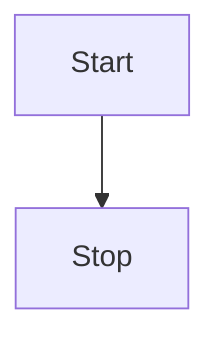

# Mermaid

Mermaid syntax highlighting is built into ZZZ.

- Tree-sitter: [tree-sitter-mermaid](https://github.com/monaqa/tree-sitter-mermaid)
- Language Server: N/A
- File extensions: `.mmd`, `.mermaid`

Markdown code fences use the same grammar:

````markdown

````

Markdown Preview renders supported Mermaid diagrams. Select **Code** in the
preview block to inspect the highlighted source.

The bundled grammar may not recognize every construct added by newer Mermaid
releases. Unsupported constructs remain editable as plain text and can still be
handled by the diagram renderer when it supports them.
